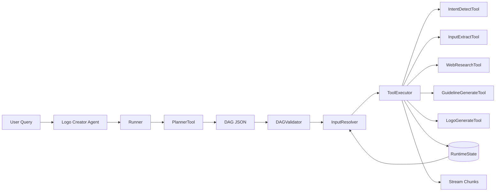
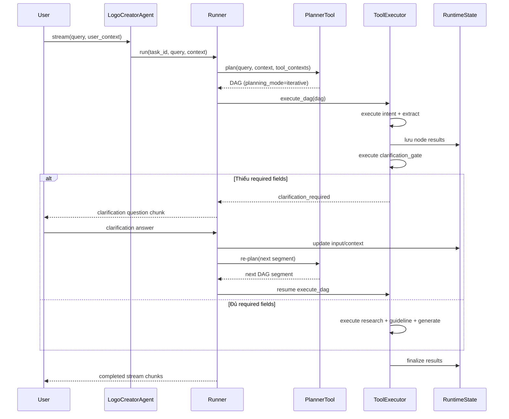

# Kế Hoạch Refactor Source (Tools + Agents + Schemas)

## 1) Phạm vi và Mục tiêu

### Trong phạm vi
- Refactor kiến trúc trong source/ theo hướng tool-first và DAG planner.
- Tập trung vào tools, orchestration theo agents, schemas, runner/executor.
- Giữ tương thích contract task hiện tại (LogoGenerateTask.stream_process).
- Ưu tiên framework OpenAI (GPT-4o), sau đó mở rộng adapter cho Google ADK.

### Ngoài phạm vi (giai đoạn này)
- Thiết kế lại observer và lifecycle.
- Thiết kế lại UI.
- Chuyển đổi persistence ngoài cơ chế session CAS hiện tại.

### Mục tiêu chính
- Loại bỏ naming theo stage (stage_a, stage_b, stage_c) ở domain logic.
- Tổ chức tool wrapper có input/output schema rõ ràng, tái sử dụng tốt.
- Planner trả về DAG JSON (nodes, edges) thay vì hardcode pipeline.
- Tool context chỉ chứa metadata + schema.
- Giữ tương thích stream behavior và clarification loop hiện tại.
- Hỗ trợ dynamic/iterative planning (re-plan) khi cần clarification.
- Đảm bảo nội suy biến runtime an toàn cho tool_input.
- Tránh tràn context window bằng cơ chế payload reference cho dữ liệu lớn.

---

## 2) Vấn đề hiện tại

1. Planner đang hardcode trình tự thực thi và chuyển trạng thái nghiệp vụ.
2. Worker theo stage bị coupling cao vào service cụ thể.
3. LogoDesignToolset đang là God-object (intent, extract, clarify, guideline cùng một chỗ).
4. Contract của tool đang ngầm định qua method, chưa là artifact bậc nhất của registry.
5. Typing của StageBExecution.guideline còn rộng (object), chưa strict schema.
6. Khó tái sử dụng cho domain khác vì naming stage và wiring trực tiếp.
7. Chưa có DAG validator thống nhất cho dependency/cycle.
8. Trace thực thi tool chưa normalize theo chuẩn ToolResult.

---

## 3) Kiến trúc đích

## 3.1 Cấu trúc thư mục đề xuất

```text
source/
  agents/
    logo_creator_agent.py
    runner.py
  planner/
    dag_models.py
    dag_validator.py
    planner_tool.py
    planner_templates.py
  tools/
    __init__.py
    base_tool.py
    intent_detect_tool.py
    input_extract_tool.py
    reference_analyze_tool.py
    clarification_tool.py
    web_research_tool.py
    guideline_generate_tool.py
    logo_generate_tool.py
    tool_search_tool.py
    researcher_tool.py
  executors/
    tool_executor.py
    result.py
    validator.py
  schemas/
    plan.py
    tool_context.py
    tool_io.py
    runtime_state.py
```

Ghi chú:
- source/services/* giữ vai trò provider/service nội bộ, được gọi từ tool class.
- source/workers/* sẽ được thay dần bằng agents/runner.py + executors/tool_executor.py.

## 3.2 Hợp đồng dữ liệu cốt lõi

### ToolContext (chỉ metadata)
- name
- description
- parameters (JSON schema của input)
- output (JSON schema của output)

### DAG JSON
- nodes: danh sách task
- edges: danh sách phụ thuộc

Node gồm:
- id: định danh node
- tool: tên tool đăng ký
- tool_input: dict (hỗ trợ template biến)
- deps: danh sách node phụ thuộc

### ToolResult
- node_id
- tool_name
- result
- error
- trace

### RuntimeState (thuộc executor)
- input: query/user_context hiện tại
- node_results: map từ node_id sang ToolResult
- artifacts: map optional cho payload lớn (path/object key)

### InputResolver (nội suy biến)
- Resolve biểu thức ${...} trong tool_input tại runtime (không resolve lúc planner).
- Nguồn dữ liệu là RuntimeState.
- Fail fast với lỗi typed nếu expression không resolve được.

### PlanningMode
- single_pass: planner trả full DAG một lần.
- iterative: planner trả DAG từng đoạn, executor có thể re-plan.

### LargePayloadRef
- ref_id: mã định danh artifact
- kind: inline | file | object_store | vector_store
- preview: tóm tắt ngắn cho node sau
- uri_or_key: vị trí lưu trữ

---

## 4) Quy tắc đổi tên

Đổi từ stage-based sang role-based:
- stage_a_worker -> intake_planning_runner (hoặc tách thành tools + runner)
- stage_b_worker -> research_guideline_runner
- stage_c_worker -> generation_runner
- GeminiResearchAnalyzer -> ReferenceInsightTool (nếu expose như tool)
- LogoDesignToolset -> tách thành các tool class độc lập

Nguyên tắc đặt tên:
- Tên class tool phải thể hiện vai trò nghiệp vụ rõ ràng.
- Tránh A/B/C trong API public.
- Tránh naming quá workflow-specific trong abstraction dùng chung.

---

## 5) Luồng thực thi mục tiêu

```text
logo_creator.stream(query, user_context)
  -> Runner.run(task_id, query, context)
    -> PlannerTool.plan(query, user_context, tool_contexts) -> DAG JSON
    -> DAGValidator.validate(dag)
    -> InputResolver.bind_with_runtime_state(...)
    -> ToolExecutor.execute_dag(dag)
      -> [Tool].execute(...)
      -> ToolResult(...)
      -> RuntimeState.update(node_result)
      -> optional RePlanner.plan_next(...) khi cần clarification
    -> Validator.react(results)
    -> stream chunks
```

### Architecture Diagram



### Sequence Diagram (Iterative Planning + Clarification)



---

## 6) Định dạng output của Planner

```json
{
  "planning_mode": "iterative",
  "nodes": [
    {
      "id": "intent",
      "tool": "intent_detect",
      "tool_input": {"query": "${query}"},
      "deps": []
    },
    {
      "id": "extract",
      "tool": "input_extract",
      "tool_input": {"query": "${query}", "references": "${user_context.references}"},
      "deps": ["intent"]
    },
    {
      "id": "clarification_gate",
      "tool": "clarification_gate",
      "tool_input": {"context": "${extract.result.context}"},
      "deps": ["extract"]
    },
    {
      "id": "clarification",
      "tool": "clarification_tool",
      "tool_input": {"missing_fields": "${clarification_gate.result.missing_fields}"},
      "deps": ["clarification_gate"]
    },
    {
      "id": "research",
      "tool": "web_research",
      "tool_input": {"brand_context": "${extract.result.context}"},
      "deps": ["clarification_gate"]
    },
    {
      "id": "guideline",
      "tool": "guideline_generate",
      "tool_input": {
        "brand_context": "${extract.result.context}",
        "research_context": "${research.result}"
      },
      "deps": ["research"]
    },
    {
      "id": "generate",
      "tool": "logo_generate",
      "tool_input": {
        "guidelines": "${guideline.result.guidelines}",
        "brand_name": "${extract.result.context.brand_name}",
        "industry": "${extract.result.context.industry}"
      },
      "deps": ["guideline"]
    }
  ],
  "edges": [
    ["intent", "extract"],
    ["extract", "clarification_gate"],
    ["clarification_gate", "clarification"],
    ["clarification_gate", "research"],
    ["research", "guideline"],
    ["guideline", "generate"]
  ]
}
```

Clarification behavior:
- Nếu clarification_gate báo thiếu required fields, runner emit chunk hỏi lại và tạm dừng.
- Sau khi user trả lời, hệ thống update RuntimeState.input rồi gọi planner để lập DAG đoạn tiếp theo.
- Nếu không thiếu required fields, bỏ qua node clarification và chạy tiếp.

Interpolation behavior:
- Biểu thức ${extract.result.context.brand_name} được resolve ngay trước khi execute node.
- Resolver hỗ trợ truy cập nested dict/list và trả lỗi rõ ràng khi thiếu path.

Large payload behavior:
- Tool có thể trả LargePayloadRef thay vì nhét dữ liệu lớn inline.
- Node sau dùng preview + uri_or_key tùy nhu cầu.

---

## 7) Kế hoạch migration

## Phase 1: Nền tảng tool + schema
- Tạo source/schemas/plan.py, tool_context.py, tool_io.py.
- Thêm RuntimeState, LargePayloadRef và ToolResult strict schema.
- Tạo source/tools/base_tool.py kế thừa ai_hub_sdk.tools.base.BaseTool.
- Tách LogoDesignToolset thành các tool class.
- Giữ song song code cũ để tránh break flow.

Deliverable:
- Có ToolRegistry và build_tool_context(tools).

## Phase 2: Planner tool + DAG validator
- Xây PlannerTool.plan() trả DAG JSON.
- Thêm validator cho cycle, missing deps.
- Schema validate strict cho output planner.
- Thêm quy ước planning mode (single_pass, iterative).

Deliverable:
- Planner trả DAG ổn định cho intake/research/generation.

## Phase 3: Tool executor + runner
- Xây ToolExecutor.execute_node() và execute_dag().
- Xây Runner.run() với dependency scheduling + result store.
- Thêm InputResolver cho ${...} từ runtime state.
- Thêm pause/re-plan cho clarification loop.
- Emit stream chunks theo event node completion.

Deliverable:
- End-to-end chạy không cần stage workers.

## Phase 4: Tương thích adapter hiện tại
- Giữ nguyên API LogoGenerateTask.stream_process.
- Route nội bộ sang runner + planner mới.
- Deprecate import cũ của stage workers.

Deliverable:
- Frontend/tests hiện tại vẫn pass.

## Phase 5: Tối ưu OpenAI-first
- Tối ưu planner prompt + strict JSON output cho GPT-4o.
- Thêm retry/repair khi planner trả JSON lỗi.
- Thêm trace cost và latency theo tool.
- Thêm policy context-budget: ngưỡng inline + fallback sang artifact ref.

Deliverable:
- Runtime OpenAI-first ổn định.

## Phase 6: Google ADK parity
- Thêm test tương thích planner/runtime trên google engine.
- Giữ chung ToolContext và DAG schema.
- Guard theo provider chỉ nằm ở adapter layer.

Deliverable:
- Cùng format plan chạy được OpenAI và Google ADK.

---

## 8) Quy tắc thiết kế để scale và tái sử dụng ngoài project

1. Tool Isolation
- source/tools/* không import planner hoặc runner.
- Tool chỉ phụ thuộc schema và provider interface được inject.

2. Pydantic Schema nghiêm ngặt
- Mỗi tool có ToolInput và ToolOutput rõ ràng.
- ToolContext.parameters/output sinh từ model_json_schema, không dùng dict lỏng.

3. Dependency Injection
- Không khởi tạo cứng HTTP/DB/API client trong execute().
- Tiêm dependencies qua constructor để test/mock dễ.

4. Tách observability khỏi lõi tool
- Logging, retry, timeout, cost tracking nằm ở executor middleware.
- Lõi tool giữ thuần, deterministic, dễ reuse.

5. Config bằng BaseSettings
- Dùng pydantic_settings.BaseSettings cho config typed và validate.
- Secret, quota, timeout được inject vào planner/executor/tools.

---

## 9) Rủi ro và giảm thiểu

Risk: Planner trả DAG JSON sai.
- Mitigation: schema validate + repair prompt + fallback template DAG.

Risk: Hành vi mới lệch flow cũ.
- Mitigation: golden tests so milestone stream chunks cũ/mới.

Risk: Đổi tên làm vỡ import.
- Mitigation: transitional re-export + deprecation warnings.

Risk: Provider concern rò rỉ vào API của tool.
- Mitigation: để provider-specific logic ở adapter layer.

Risk: Sai path nội suy gây crash runtime.
- Mitigation: InputResolver trung tâm + parser path strict + validate trước execute.

Risk: Clarification loop bị deadlock.
- Mitigation: giới hạn số vòng clarification + fallback deterministic + terminal fail state.

Risk: Payload trung gian quá lớn làm nổ token budget.
- Mitigation: trả LargePayloadRef + summary ngắn cho node sau.

---

## 10) Danh sách việc làm ngay

1. Tạo source/schemas/plan.py với DAG models.
2. Tạo source/schemas/tool_context.py với metadata-only contract.
3. Tạo source/schemas/runtime_state.py cho runtime state.
4. Tạo source/tools/* class cho nhóm tác vụ hiện tại.
5. Tạo source/planner/planner_tool.py cho OpenAI-first DAG planning.
6. Tạo source/executors/input_resolver.py cho ${...} binding.
7. Tạo source/executors/tool_executor.py cho node execution.
8. Viết tests:
- planner DAG validity,
- topological ordering,
- tool input/output schema validation,
- fallback khi planner trả malformed JSON,
- interpolation resolution success/failure,
- clarification pause + re-plan,
- large payload reference handoff.
