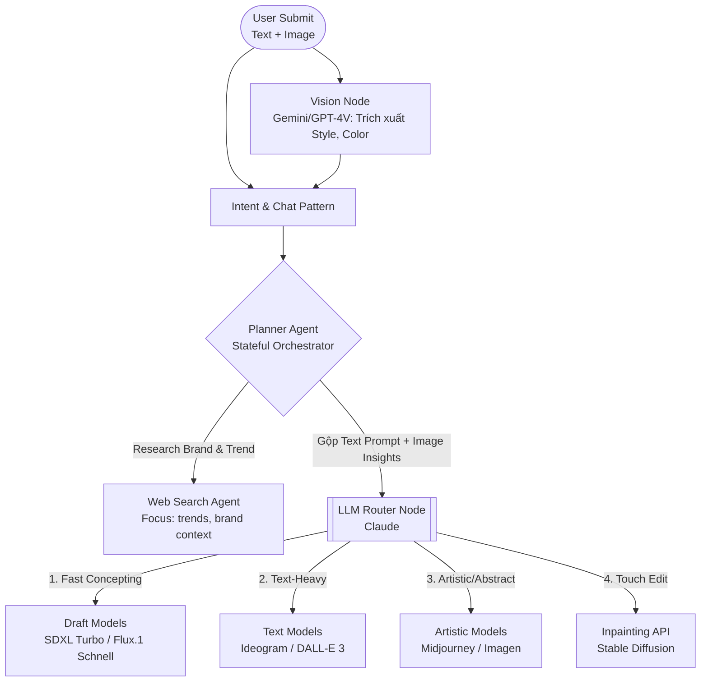
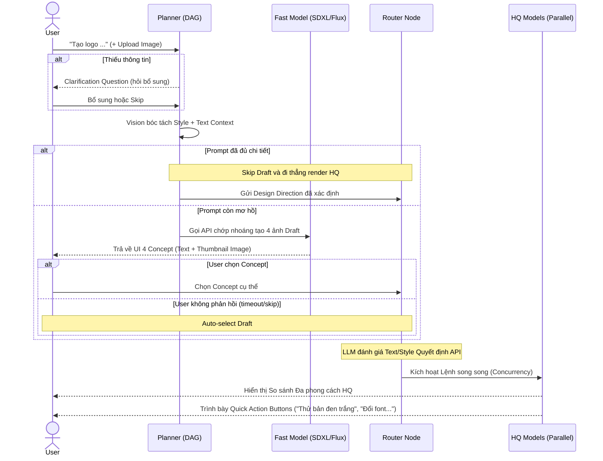

# AI Logo Design Agent - Architecture & User Flow

Tài liệu này đặc tả việc phân tích trải nghiệm từ các giải pháp hiện có trên thị trường (Genspark, Lovart), qua đó đề xuất kiến trúc hệ thống, luồng xử lý cốt lõi (Core Logic) và trải nghiệm người dùng (User Flow) của AI Logo Design Agent.

## 1. Phân tích Trải nghiệm Thực tế (Genspark vs Lovart)

### 1.1. Genspark
Genspark sử dụng kiến trúc **Dynamic Multi-Agent**. Khi user đưa request, một "Planner Agent" sẽ tự động sinh ra các "Worker Agents" (đi search web, đi vẽ ảnh) một cách linh hoạt, không cố định luồng. Kiến trúc này mang lại những điểm sáng nhưng cũng dễ gây ra lỗi ảo giác (hallucination) hoặc khiến hệ thống mắc kẹt trong vòng lặp generate liên tục.

**Ưu điểm (Pros):**
- **Web Search mượt & linh hoạt:** Khả năng tìm kiếm của Genspark đa dạng hơn, tập trung lấy context nghiên cứu (research) theo các keyword như trend, best, top, hot... và trỏ trực tiếp đến chuyên môn logo design.
- **Chat tự động (Auto-detect):** Tự động nhận diện ý định và kích hoạt luồng làm việc mà không yêu cầu user thao tác rườm rà.

**Nhược điểm & Vấn đề (Cons & Issues):**
- **Khuyết điểm Edit (Must redraw):** Genspark thiếu khả năng can thiệp chỉnh sửa chi tiết. Nó buộc user manual layer phần cần edit thay vì "Touch edit detection" như của Lovart.

### 1.2. Lovart
Lovart mang lại trải nghiệm thao tác thiết kế "bay bổng" hơn, nhưng lại yếu ở khả năng thấu hiểu ngữ cảnh (AI logic).

**Ưu điểm (Pros):**
- **Giao diện Canvas Design vượt trội:** Trải nghiệm chỉnh sửa trực quan ngay trên vùng làm việc mang lại cảm giác dễ chịu giống Canva (Về mảng Design Canvas: Lovart > Genspark).
- **Tính năng "Touch Edit":** Cho phép người dùng chọn một vùng ảnh và sửa (đòi hỏi mô hình Regional Prompting hoặc Image-to-Image / Inpainting chuyên biệt).

**Nhược điểm & Vấn đề (Cons & Issues):**
- **Web Search "trật trọng tâm":** Search của Lovart không focus được vào "Brand" mà bị đánh lừa bởi bề mặt "sự vật" trong query. Ví dụ: Với request "i wanna to gen logo for sport clothes store", Lovart sẽ chỉ lấy keyword "sport" để search (người chạy bộ, vận động viên) chứ không nhận diện được trọng tâm là "logo brand".
- **Trải nghiệm Chat thủ công, rườm rà:** Hệ thống không tự detect ý định mượt mà như Genspark. User phải tự tay thao tác qua nhiều bước trung gian: Set up model, web search, thinking/fast hay agent direction.

- **Thuyết minh "bằng chữ" nhàm chán:** Việc LLM dừng lại sinh ra các đề xuất hướng thiết kế thuần túy bằng text khiến user rất khó để hình dung visual của logo trông sẽ như thế nào.

---

## 2. Giải pháp & Bối cảnh Kiến trúc (Our Approach)

Hệ thống AI Logo Design của chúng ta được cấu trúc để **kế thừa các điểm mạnh và loại bỏ lỗ hổng**:

1. **Intelligent Auto-detect:** Sử dụng AI Planner nhận diện ý định và Smart Web Search tập trung nội dung thương hiệu như Genspark, nhưng vận hành trên một luồng logic rẽ nhánh an toàn hơn.
2. **Drafting Pattern:** Tích hợp sinh ảnh nháp tốc độ cao (Fast/Cheap Model) đi kèm dòng text mô tả, giải quyết vấn đề "đọc chữ khó hình dung".
3. **Canvas Design & Touch Edit:** Xây dựng front-end Canvas và quy trình Inpainting chuyên sâu như Lovart cho thao tác tương tác chỉnh sửa vùng cục bộ.
4. **Side-by-side Rendering:** Hỗ trợ render đồng thời (Concurrency) đa mô hình, giúp user so sánh trực quan các phong cách đồ hoạ.

---

## 3. Kiến trúc Stateful DAG kết hợp LLM Orchestrator/Router

> **Chú ý kiến trúc:** Rút kinh nghiệm từ điểm yếu Dynamic Multi-Agent của Genspark (các Agent tự do nói chuyện dễ sinh ảo giác và vòng lặp), hệ thống áp dụng kiến trúc **Stateful DAG với LLM Orchestrator/Router** (Đồ thị luồng tĩnh kết hợp bộ định tuyến động). Dữ liệu đi qua các Node theo cấu trúc tuyến tính rẽ nhánh và hoàn toàn có thể dự đoán/kiểm soát được. 

Bên cạnh Text, hệ thống sở hữu **Luồng Xử lý Đa phương thức (Multimodal Input)** trọng tâm để khai thác đầu vào từ Ảnh tham khảo (Reference Image) do người dùng cung cấp.

## 4. Luồng trải nghiệm & Drafting Pattern (User Flow)

**Trải nghiệm Drafting Pattern (có điều kiện):** Hệ thống chỉ gọi 4 ảnh Draft khi yêu cầu còn mơ hồ và có nhiều hướng diễn giải. Nếu prompt đã chi tiết (ví dụ chỉ rõ form, màu, font), hệ thống bỏ qua Draft và đi thẳng sang render HQ. Nếu thiếu thông tin đầu vào, agent sẽ hỏi Clarification trước. Nếu user không phản hồi ở bước chọn hướng, hệ thống tự chọn phương án mặc định #1 

**Sau khi render xong (trước bước Edit)**: dưới màn hình sẽ xuất hiện các **Quick action buttons (Nút thao tác nhanh)** như "Thử bản đen trắng", "Đổi font chữ hiện đại hơn"... để gợi ý người dùng tiếp tục khám phá mà không cần tự gõ prompt.

## 5. Reasoning & Inference Engine 

Lớp này xử lý suy luận trước khi Router gọi model ảnh. Trọng tâm là biến yêu cầu thô thành Design Direction có giải thích rõ ràng.

1. **Input Understanding:** Bóc tách có cấu trúc các trường: Brand Name, Industry, Core Values, Target Audience, Constraints.
2. **Image Reference Analysis:** Nếu có ảnh tham khảo, Vision model trích xuất style cues (shape language, palette, typography, density).
3. **Style Mapping:** Ánh xạ ngữ cảnh sang quy tắc ngành (ví dụ `Tech -> Minimalist/Geometric`, `F&B -> Warm/Vintage`) và xử lý xung đột ưu tiên.
4. **Reference Exploration:** Gọi Web/Image Search để lấy tín hiệu xu hướng và đối sánh visual.
5. **Streaming UX:** Toàn bộ các bước reasoning trên được stream real-time xuống UI qua `AIHubStreamService` (Input Understanding -> Image Analysis -> Style Inference -> Reference Exploration).

## 6. Core Logic: LLM Router Node
Dùng AI (Claude) làm "bộ não" đọc yêu cầu thiết kế và tự quyết định gọi API nào. Nhờ kiến trúc hỗ trợ **Xử lý Song song (Concurrency)**, Router có thể gởi lệnh tới 2 model cùng 1 lúc và trả kết quả side-by-side (VD: "Để xem cùng 1 prompt DALL-E 3 và Imagen vẽ khác nhau ra sao").

### Routing Rules cho LLM:
1. **Rule 1 (Text Accuracy):** Nếu prompt yêu cầu có chữ cụ thể trong logo (VD: "Logo có chữ NovaAI").
   
   **Target Cụm Model:** DALL-E 3 hoặc Ideogram.
   
   *(Lý do: Khả năng render text của 2 model này là đỉnh nhất. Ideogram còn tỏ ra vượt trội ở mảng thiết kế, tính nhất quán. Cấu trúc học Text Encoder của các model này có khả năng hiểu được "hình dáng" của từng ký tự N, o, v, a, A, I được cấu thành như thế nào kế bên mặt ngữ nghĩa của từ).*
2. **Rule 2 (Abstract/Artistic):** Nếu yêu cầu là khối biểu tượng trừu tượng, họa phẩm nghệ thuật hoặc photorealistic.
   
   **Target Cụm Model:** Midjourney API hoặc Imagen.
   
   *(Lý do: Cụm Model này mang tư duy hội họa sáng tạo nghệ thuật mảng miếng cực tốt với độ thẩm mỹ vô đối. Imagen sinh màu sắc rực rỡ sắc nét).*
3. **Rule 3 (Touch Edit/Inpainting):** Nếu user đang ở bước Edit muốn sửa 1 chi tiết cục bộ.
   
   **Target Cụm Model:** Stable Diffusion Inpainting API.

## 7. Chức năng Touch Edit (Smart Region Inpainting)

Để đem lại trải nghiệm mượt mà, hệ thống sẽ kết hợp 2 lớp mô hình AI cho tính năng Edit, khắc phục triệt để lỗ hổng "phải vẽ lại cả bức" như Genspark:

1. **Auto-Segmentation (Lớp Frontend/Edge):**
   Giao diện Canvas tích hợp công cụ **Smart Mark** hoạt động dựa trên các mô hình bóc tách đối tượng (như *SAM - Segment Anything Model*). User chỉ cần thao tác **Click** vào một đối tượng (icon cánh chim, dải màu, text), AI sẽ tự động khoanh vùng viền chính xác (*Pixel-perfect Mask*) và gắn nhãn (*Tagging*) đối tượng đó vào khung parameter chat. 
   *(Hỗ trợ fallback: Trường hợp hình phức tạp model bắt sai viền, user có thể tự dùng công cụ Brush để tô thủ công vùng cần chọn).*

2. **Inpainting API (Lớp Backend):**
   Khi user bấm gửi lệnh Edit (VD: "Đổi cánh chim thành màu đỏ"), Backend sẽ nhận cụm 3 parameter (payloads):
   - **Source Image** (Ảnh nguyên gốc).
   - **Binary Mask** (Lớp mặt nạ trắng/đen tạo ra từ Frontend).
   - **Text Prompt** (Câu lệnh sửa).
   
   Router Node lập tức đẩy thông tin cho Model Inpainting chuyên biệt (Stable Diffusion Inpainting) bắt tay xử lý, render lại ĐÚNG khu vực Mask trong khi giữ nguyên 100% các chi tiết bên ngoài viền.

## 8. Các tính năng Đề xuất Mở rộng (So với Spec ban đầu)

Để mang lại luồng trải nghiệm tốt hơn Genspark/Lovart, kiến trúc trên đã bổ sung một số tính năng mở rộng **không có trong POC Spec gốc**, bao gồm:

1. **Drafting Pattern (Sinh ảnh nháp siêu tốc):** Spec gốc chỉ nói về việc đề xuất hướng đi, nhưng thực tế user không thể đọc text mà tưởng tượng ra hình. Giải pháp dùng SDXL/Flux tạo Thumbnail Preview là thiết kế thêm để cứu vãn UX.
2. **Concurrency / Side-by-side Rendering:** Spec gốc không nhắc đến việc đánh giá năng lực các model. Ở đây kiến trúc router có hỗ trợ gọi song song nhiều API (VD: *DALL-E 3 vs Imagen*) để cung cấp cơ chế A/B testing trực quan cho designer.
3. **Smart Mark / Móc nối Inpainting:** Spec có nhắc việc sửa chữa nhưng không đặc tả kỹ thuật. Kiến trúc bổ sung quy trình 2 lớp: Frontend dùng SAM (Segment Anything) tự động bắt viền (Pixel-perfect mask), Backend dùng Stable Diffusion Inpainting để chỉ render đúng điểm chọn, tránh hiện tượng sinh mới hoàn toàn.
4. **Interactive Quick Actions:** Hệ thống chủ động sinh các nút thao tác nhanh (Quick Action Buttons) dưới mỗi Output vừa Generate xong. Các nút này dựa trên Context và Visual output để gợi ý user thao tác khám phá nhanh (VD: "Đổi màu đen trắng", "Sử dụng font hiện đại") thay vì ép user phải type chay trong text box (điểm cả Genspark & Lovart đều đang thiếu).
