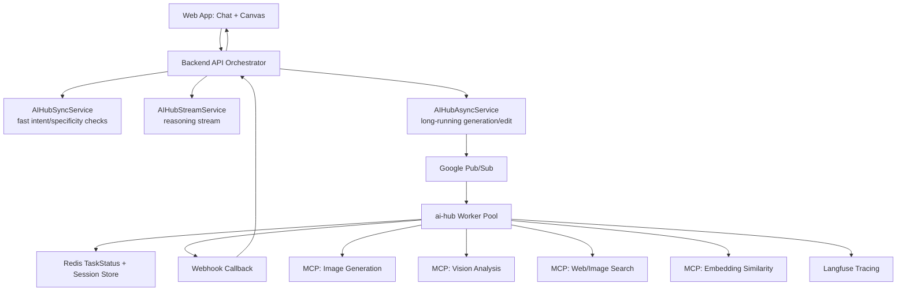
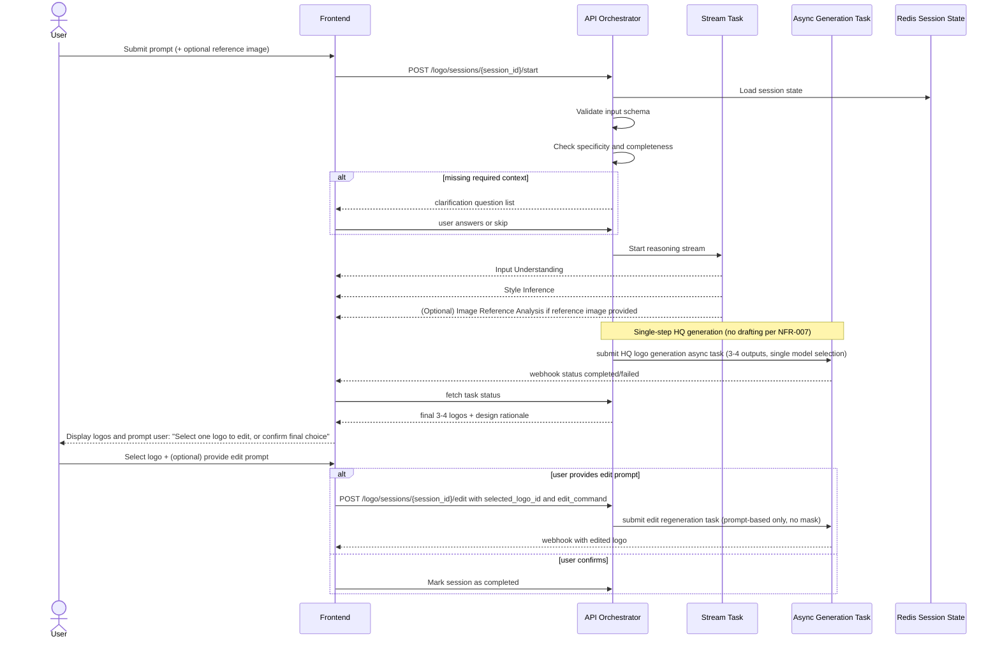

# Technical Design Document (TDD)

Feature: AI Logo Design Agent (POC Phase 1)  
Branch: 001-logo-design-agent  
Date: 2026-03-22  
Status: Implementation-ready (POC-aligned, scope-controlled)

## 1. Purpose and Scope

This document translates the product spec and architecture into an implementation-ready system design using ai-hub-sdk.

Objectives:
- Define end-to-end workflow logic (agent pipeline) aligned with FR-001..FR-014, **strictly bounded by POC scope constraints**.
- Define Pydantic data schemas for task I/O and session state.
- Define orchestrator design for conditional branching, retries, and multi-turn flow (without drafting or auto-selection).
- Define frontend stack and API interaction model for text-only reasoning and prompt-based editing.
- **Enforce POC scope**: No drafting pattern (NFR-007), no touch edit/smart mark (NFR-006), no multi-model routing (NFR-005), no timeout auto-selection (keeps UX explicit and simple).

## 2. Design Principles

1. Deterministic pipeline with explicit branch conditions.
2. Fail-fast and transparent errors to user (no silent retries).
3. Real-time reasoning visibility before image generation.
4. Strict schema validation at all boundaries.
5. Stateless workers plus Redis-backed session state.
6. MCP-only external tool integration for generation/vision/search.

## 3. System Context

## 3.1 Core platform

- ai-hub-sdk communication layer:
  - AIHubSyncService for fast decisions.
  - AIHubStreamService for visible reasoning chunks.
  - AIHubAsyncService for image generation/edit/evaluation jobs.
- Worker runtime:
  - BaseTask subclasses auto-discovered by TaskFactory via AI_HUB_SDK_TASK_DIR.
  - Pub/Sub for async queueing and scaling.
  - TaskStatusManager (Redis) for task status, result, metadata, TTL.
  - WebhookHandler for callback delivery.
- Tooling:
  - ai_hub_sdk.tools.mcp.MCPTool for all external tools.

## 3.2 External dependencies

- Image generation MCP servers (DALL-E 3, Ideogram, Midjourney, Imagen, SD Inpainting).
- Vision MCP server (reference style extraction).
- Web/Image search MCP server (reference exploration).
- Optional embedding MCP server (semantic style retrieval).
- Observability backend (Langfuse).

## 4. High-level Architecture



## 5. Workflow Logic (Agent Pipeline)

## 5.1 Pipeline states

Session state machine (simplified, 7 states for POC clarity):
- NEW: Session initialized, awaiting user prompt
- NEEDS_CLARIFICATION: Missing required context, asking follow-up questions
- REASONING: Processing brand context and emitting reasoning chunks before generation
- GENERATING: HQ logo generation in progress (single-model, 3-4 outputs)
- AWAITING_SELECTION: Generated logos displayed, user must select one
- EDITING: User-selected logo sent for prompt-based edit regeneration
- COMPLETED: Flow finished, final output delivered or error resolved

**Removed states** (out of POC scope):
- ❌ DRAFTING_OPTIONAL (no drafting pattern per NFR-007)
- ❌ AWAIT_DIRECTION_SELECTION (no direction selector per simplified UX)
- ❌ HQ_RENDERING (implicit within GENERATING)
- ❌ EDIT_RENDERING (implicit within EDITING)
- ❌ FAILED as separate state (errors transition to COMPLETED with failure details)

## 5.2 Main flow



## 5.3 Single-Model Selection (Not Multi-Model Routing)

**POC Constraint** (NFR-005): Single model generation selected once per session, not dynamically per request.

**Selection Logic** (deterministic, chosen at session start by orchestrator based on brand context):
- **Default Model**: DALL-E 3 (strong text rendering, consistent quality, broad style range)
- **Alternative** (if explicitly requested in future, not POC): Ideogram (superior design consistency)

**Not implemented in POC**:
- ❌ Rule B: abstract/artistic routing to Midjourney/Imagen (single model only)
- ❌ Rule C: regional edit with inpainting (prompt-based edit only, NFR-006 out of scope)
- ❌ Multi-threading: parallel requests to multiple models for A/B comparison
- ❌ Router logic: LLM-based model selection per request (fixed model per session)

## 5.4 Assumptions & Edge Cases (Simplified for POC)

- **If user skips clarification**: Continue with documented assumptions (FR-013). System persists assumption list and surfaces before generation (NFR-003).
- **If no brand name provided**: Generate symbol-focused concept with note to user (edge case, acceptable)
- **If conflicting style constraints**: Choose dominant constraint and explain reasoning in stream output
- **❌ Removed (POC simplicity)**: No timeout-based auto-default direction selection. User experiences linear, explicit flow without timeouts or automata.

## 6. Orchestrator Design

## 6.1 Responsibilities

Backend API orchestrator responsibilities:
- Session lifecycle management.
- Branch decision (clarify, skip draft, default select).
- Trigger stream/sync/async tasks in correct order.
- Merge outputs for frontend DTO.
- Persist session checkpoints.

Worker task responsibilities:
- Execute domain logic for a single task type.
- Call MCP tools.
- Validate and normalize task output.
- Emit metadata and traces.

## 6.2 Task Catalog (POC-Aligned, Single-Model)

**Only 4 core tasks** (no drafting or multi-model):

1. **logo_intent_check_task**
   - ServingMode: SYNC
   - Purpose: Detect logo intent (FR-001), extract brand context (FR-002)
   - Input: user prompt (+ optional reference image)
   - Output: normalized BrandContext, confidence score

2. **logo_reasoning_stream_task**
   - ServingMode: STREAM
   - Purpose: Emit reasoning chunks before generation (FR-005): Input Understanding, [Image Reference Analysis if image], Style Inference
   - Input: BrandContext, clarification answers (if any)
   - Output: Stream of ReasoningBlock chunks

3. **logo_generate_hq_task**
   - ServingMode: ASYNC
   - Purpose: Generate exactly 3-4 high-quality logos using single selected model (FR-007), produce design guideline (FR-006)
   - Input: BrandContext, ReasoningOutput, selected model ID
   - Output: [LogoAsset, LogoAsset, LogoAsset, LogoAsset], DesignGuideline, quality metadata

4. **logo_edit_task**
   - ServingMode: ASYNC
   - Purpose: Regenerate selected logo with prompt-based edit (FR-010), no inpainting mask (NFR-006)
   - Input: selected LogoAsset ID, edit_command (text prompt)
   - Output: updated LogoAsset, brief edit_summary

**❌ Tasks NOT in POC**:
- logo_generate_draft_task (drafting pattern out of scope, NFR-007)
- logo_auto_evaluate_task (evaluation deferred, NFR-007)
- logo_mask_segmentation_task (SAM smart mark out of scope, NFR-006)

## 6.3 Orchestrator pseudocode

```python
async def start_logo_flow(session_id: str, req: StartLogoRequest) -> StartLogoResponse:
    state = await session_repo.get_or_create(session_id)

    # 1. Sync check intent & context
    parsed = await sync_client.compute(task_type="logo_intent_check_task", input_args=req.model_dump())
    ensure_logo_intent(parsed)

    # 2. Clarification branching
    if parsed.result["needs_clarification"]:
        return StartLogoResponse(next_action="clarify", clarification_questions=parsed.result["questions"])

    # 3. Stream reasoning chunks to UI
    stream_id = await stream_client.stream(task_type="logo_reasoning_stream_task", input_args={
        "session_id": session_id,
        "brand_context": parsed.result["brand_context"],
        "reference_image": req.reference_image,
    })

    # 4. Async submit HQ Generation (Bỏ qua hoàn toàn Draft)
    task_id = await async_client.submit_task(task_type="logo_generate_hq_task", input_args={
        "session_id": session_id,
        "direction": parsed.result["resolved_direction"],
        "brand_context": parsed.result["brand_context"],
        "webhook_url": req.webhook_url # Lưu ý truyền webhook URL cho SDK
    })
    
    return StartLogoResponse(next_action="wait_hq", task_id=task_id, stream_id=stream_id)
```

## 7. Data Schema (Pydantic)

## 7.1 Domain models

```python
from enum import Enum
from typing import List, Optional, Dict, Literal
from pydantic import BaseModel, Field, HttpUrl

class Industry(str, Enum):
    TECH = "tech"
    FNB = "fnb"
    BEAUTY = "beauty"
    OTHER = "other"

class BrandContext(BaseModel):
    name: Optional[str] = None
    industry: Industry = Industry.OTHER
    core_values: List[str] = Field(default_factory=list)
    target_audience: Optional[str] = None
    tone: Optional[str] = None

class StyleCue(BaseModel):
    shape_language: List[str] = Field(default_factory=list)
    palette: List[str] = Field(default_factory=list)
    typography: List[str] = Field(default_factory=list)
    density: Optional[str] = None

class DesignDirection(BaseModel):
    direction_id: str
    title: str
    summary: str
    visual_direction: List[str]
    prompt_seed: str

class LogoAsset(BaseModel):
    asset_id: str
    image_url: HttpUrl
    model_provider: str
    width: int
    height: int
    direction_id: str
    metadata: Dict[str, str] = Field(default_factory=dict)
```

## 7.2 Task input/output models

```python
from ai_hub_sdk.core.task import TaskInputBaseModel, TaskOutputBaseModel

class StartLogoRequest(TaskInputBaseModel):
    session_id: str
    user_message: str
    reference_image_url: Optional[HttpUrl] = None

class IntentCheckOutput(TaskOutputBaseModel):
    is_logo_intent: bool
    confidence: float
    is_specific_prompt: bool
    needs_clarification: bool
    questions: List[str] = Field(default_factory=list)
    brand_context: BrandContext
    resolved_direction: Optional[DesignDirection] = None

class ReasoningChunk(TaskOutputBaseModel):
    stage: Literal[
        "input_understanding",
        "image_reference_analysis",
        "style_inference",
        "reference_exploration",
        "done"
    ]
    title: str
    bullets: List[str] = Field(default_factory=list)

class GenerateDraftInput(TaskInputBaseModel):
    session_id: str
    brand_context: BrandContext
    reference_image_url: Optional[HttpUrl] = None

class GenerateDraftOutput(TaskOutputBaseModel):
    directions: List[DesignDirection]
    draft_assets: List[LogoAsset]

class GenerateHQInput(TaskInputBaseModel):
    session_id: str
    brand_context: BrandContext
    selected_direction: DesignDirection
    variation_count: int = Field(default=4, ge=1, le=4)

class GenerateHQOutput(TaskOutputBaseModel):
    logos: List[LogoAsset]
    design_rationale: List[str]
    quick_actions: List[str]

class EditLogoInput(TaskInputBaseModel):
    session_id: str
    source_asset_id: str
    source_image_url: HttpUrl
    mask_url: Optional[HttpUrl] = None
    edit_command: str

class EditLogoOutput(TaskOutputBaseModel):
    updated_logo: LogoAsset
    edit_summary: List[str]
```

## 7.3 Session state schema

```python
class SessionPhase(str, Enum):
    NEW = "new"
    NEEDS_CLARIFICATION = "needs_clarification"
    REASONING = "reasoning"
    AWAIT_DIRECTION_SELECTION = "await_direction_selection"
    HQ_RENDERING = "hq_rendering"
    AWAIT_EDIT = "await_edit"
    EDIT_RENDERING = "edit_rendering"
    COMPLETED = "completed"
    FAILED = "failed"

class SessionState(BaseModel):
    session_id: str
    phase: SessionPhase = SessionPhase.NEW
    brand_context: Optional[BrandContext] = None
    inferred_directions: List[DesignDirection] = Field(default_factory=list)
    selected_direction_id: Optional[str] = None
    last_assets: List[LogoAsset] = Field(default_factory=list)
    assumptions: List[str] = Field(default_factory=list)
    timeout_default_applied: bool = False
```

Redis key strategy:
- session:{session_id}:state -> SessionState JSON
- session:{session_id}:events -> append-only reasoning/events log
- task:{task_id}:status -> ai-hub TaskStatus

## 8. Frontend Stack Proposal

## 8.1 Recommended Stack (Simplified for POC)

- **Framework**: Next.js (App Router) + TypeScript
- **UI Components**: Tailwind CSS + shadcn/ui
- **State & API Caching**: TanStack Query (React Query)
- **Real-time Reasoning Stream**:
  - Primary: gRPC-web stream bridge or NDJSON HTTP stream
  - Fallback: Server-Sent Events (SSE)
- **Form Validation**: React Hook Form + Zod

**❌ NOT in POC** (deferred to Phase 2):
- ❌ Canvas editing (React + Konva) - no touch edit
- ❌ SAM local edge detection - no smart mark UI
- ❌ Region mask interaction tools - scope simplification

## 8.2 Frontend Modules (POC Only)

**Core Modules**:
1. **ChatPanel**: Prompt input field, reasoning streaming display, (optional) reference image upload, clarification question handling
2. **ReasoningDisplay**: Timeline of streamed reasoning blocks (Input Understanding → Style Inference), with latency timestamps
3. **LogoGallery**: Display 3-4 generated logos in a grid, each with:
   - Logo thumbnail (1024x1024 or responsive)
   - Quality badge (passes all 4 quality checks: single_primary_mark, no_unreadable_text, no_severe_pixelation, guideline_consistency)
   - Plain text design rationale from DesignGuideline
4. **LogoSelector**: User selects one logo; system remembers selection for edit flow
5. **EditPromptInput**: Text field for edit command when user wants to modify selected logo (e.g., "change bird wing to blue")
6. **TaskStatusClient**: Webhook listener + SSE fallback for async task completion notifications

**❌ NOT in POC**:
- ❌ DirectionSelector (no drafting, no direction choice)
- ❌ CanvasEditor (no touch edit, no SAM smart mark)
- ❌ QuickActionsButtons (no AI-suggested quick edits)

## 8.3 API Surface (POC-Minimal)

**Required Endpoints**:
1. `POST /api/logo/sessions/{session_id}/start`
   - Input: prompt (text), reference_image_url (optional)
   - Output: task_id, stream_id for reasoning, clarification_questions (if needed)

2. `POST /api/logo/sessions/{session_id}/clarify`
   - Input: clarification_answers (dict) or skip=true
   - Output: reasoning stream started, generation task submitted

3. `POST /api/logo/sessions/{session_id}/edit`
   - Input: selected_logo_id, edit_command (text prompt)
   - Output: edit task_id, webhook notification on completion

4. `GET /api/logo/sessions/{session_id}`
   - Output: current session state, current phase, last generated logos

5. `GET /api/logo/tasks/{task_id}/status`
   - Output: task status, result (if completed), error (if failed)

**❌ NOT in POC**:
- ❌ POST /api/logo/sessions/{session_id}/direction/select (no drafting, no direction choosing)
- ❌ POST /api/logo/sessions/{session_id}/direction/auto-default (no timeout auto-selection)
- ❌ POST /api/logo/sessions/{session_id}/mask-upload (no inpainting in POC)

## 9. POC Scope (Build vs Defer)

## 9.1 Build in POC

**Core Features** (aligned with spec FR-001..FR-014):

1. ✅ **Intent detection** (FR-001): Recognize logo design intent from text input
2. ✅ **Brand context extraction** (FR-002): Parse brand name, industry, style intent from prompt
3. ✅ **Clarification flow** (FR-003, FR-004): Ask optional clarification if context incomplete; allow user to skip and document assumptions
4. ✅ **Reasoning stream** (FR-005): Emit structured reasoning blocks before generation (Input Understanding, Style Inference)
5. ✅ **Single-step HQ generation** (FR-006, FR-007): Generate exactly 3-4 logos using single model selection; output explicit design guideline
6. ✅ **Logo selection** (FR-008): Require user to select one logo from generated set
7. ✅ **Prompt-based edit** (FR-009, FR-010): Support text-only edit commands; regenerate selected logo without mask/inpainting
8. ✅ **Session context** (FR-011): Preserve single-session conversational state via Redis
9. ✅ **Transparent error handling** (FR-012): Fail-fast with actionable retry guidance
10. ✅ **Assumption documentation** (FR-013): List assumptions made during skip/defaults; surface before generation
11. ✅ **PNG quality validation** (FR-014): Verify outputs meet 1024x1024 + 4 quality checks
12. ✅ **Observability**: Node-level tracing to Langfuse (trace per reasoning, generation, edit call)

**❌ Explicitly OUT OF POC** (per NFR-005, NFR-006, NFR-007):
- ❌ Drafting pattern (fast SDXL/Flux previews) → 4-week delivery risk
- ❌ Touch Edit / Smart Mark / SAM auto-segmentation → canvas complexity
- ❌ Multi-model routing (DALL-E vs Ideogram vs Midjourney) → integration risk
- ❌ Timeout auto-selection + direction chooser → UX complexity
- ❌ Quick actions UI buttons → polish-phase feature
- ❌ Parallel multi-provider generation → latency + cost unpredictable

## 9.2 Defer to Phase 2+

The following features are **explicitly deferred** and blocked by NFR-005/NFR-006/NFR-007:

1. **Drafting Pattern** (NFR-007): Fast SDXL/Flux preview stage + direction selector
2. **Multi-Model Routing** (NFR-005): Parallel generation across DALL-E 3, Ideogram, Midjourney
3. **Touch Edit + Smart Mark** (NFR-006): Canvas-based region selection, SAM auto-segmentation, inpainting masks
4. **Timeout Auto-Selection**: Direction auto-default if no user response (keeps UX simpler and more predictable)
5. **Quick Actions UI** (quick-edit suggestions): LLM-generated button suggestions per output
6. **Persistent Project History**: Cross-visit session resumption, version control
7. **Enterprise Features**: RBAC, quotas, audit trails, cost tracking
8. **Advanced Export**: SVG pipeline, print-optimized assets, batch operations
9. **Auto-Evaluation**: LLM-as-judge quality scoring and retraining loops

## 10. Implementation Plan (4-Week POC)

### Week 1-2: Foundation
- ✅ Implement Pydantic schemas (BrandContext, ReasoningBlock, DesignGuideline, LogoOption, SessionState)
- ✅ Implement logo_intent_check_task (SYNC, detect logo intent + extract brand context)
- ✅ Implement logo_reasoning_stream_task (STREAM, emit reasoning chunks)
- ✅ Build API orchestrator: POST /start, POST /clarify, GET /status endpoints
- ✅ Wire Redis session store and task status manager

### Week 2-3: Generation
- ✅ Implement logo_generate_hq_task (ASYNC, single-model selection, 3-4 outputs)
- ✅ Implement DesignGuideline generation from reasoning output
- ✅ Wire AIHubAsyncService + Pub/Sub task submission
- ✅ Implement webhook callback handler for task completion
- ✅ Build frontend: ReasoningDisplay, LogoGallery, LogoSelector, EditPromptInput

### Week 3-4: Edit + Validation
- ✅ Implement logo_edit_task (ASYNC, prompt-based regeneration, no mask)
- ✅ Implement quality validation checks (1024x1024, 4 quality checks per FR-014)
- ✅ Add node-level Langfuse tracing per task
- ✅ E2E acceptance tests: test SC-001 through SC-006 + edge cases
- ✅ Quickstart smoke test validation (T026)

**NO PARALLEL ACTIVITIES** (keep scope tight):
- ❌ No drafting UI scaffolding (no DirectionSelector, no draft generation task)
- ❌ No canvas/mask implementation (save for Phase 2)
- ❌ No multi-model comparison logic (single model fixed per session)
- ❌ No auto-evaluation task (manual review sufficient for POC)

## 11. Testing Strategy

- Unit tests:
  - schema validation and coercion
  - routing decision function
  - default selection logic
- Integration tests:
  - async submit -> webhook -> status retrieval
  - stream chunk order and final chunk metadata
  - session state transitions
- E2E tests:
  - prompt to final logos
  - ambiguous prompt requiring direction selection
  - edit targeted region and preserve outside region
- Failure tests:
  - tool timeout and fail-fast error propagation
  - malformed payload rejection at schema boundary

## 12. Risks and Mitigations

1. Tool response schema drift.
- Mitigation: strict Pydantic adapters per MCP tool version.

2. Stream and async race conditions.
- Mitigation: state transition guard with optimistic lock version field.

3. High latency from multi-tool reasoning.
- Mitigation: cap reference search calls and parallelize independent lookups.

4. Edit quality inconsistency.
- Mitigation: keep mask UX simple in POC and add fallback regenerate option.

## 13. Acceptance for Technical Readiness

Design is technically ready when:
- Task interfaces and schemas are code-generated and validated.
- Orchestrator flow passes all state transition tests.
- Core POC scenarios run end-to-end in staging.
- Observability dashboards show per-node latency, token usage, and error rates.
- Failure modes produce user-visible actionable messages.
