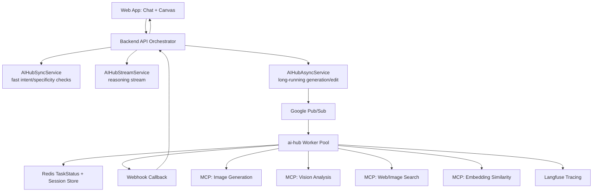
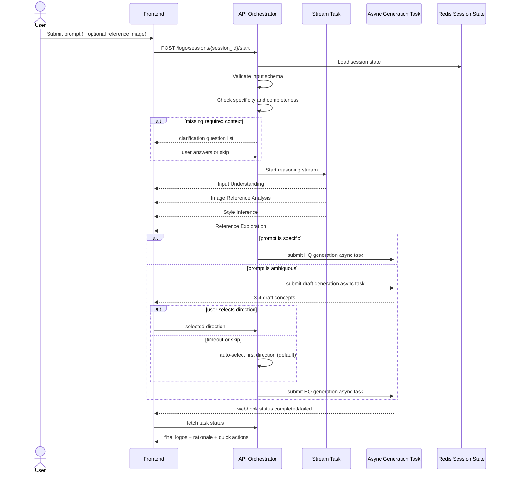

# Technical Design Document (TDD)

Feature: AI Logo Design Agent  
Branch: 001-logo-design-agent  
Date: 2026-03-21  
Status: Implementation-ready

## 1. Purpose and Scope

This document translates the product spec and architecture into an implementation-ready system design using ai-hub-sdk.

Objectives:
- Define end-to-end workflow logic (agent pipeline) aligned with FR-001..FR-014.
- Define Pydantic data schemas for task I/O and session state.
- Define orchestrator design for conditional branching, retries, defaults, and multi-turn flow.
- Define frontend stack and API interaction model.
- Clearly separate POC scope from deferred scope.

## 2. Design Principles

1. Deterministic pipeline with explicit branch conditions.
2. Fail-fast and transparent errors to user (no silent retries).
3. Real-time reasoning visibility before image generation.
4. Strict schema validation at all boundaries.
5. Stateless workers plus Redis-backed session state.
6. MCP-only external tool integration for generation/vision/search.

## 3. System Context

## 3.1 Core platform

- ai-hub-sdk communication layer:
  - AIHubSyncService for fast decisions.
  - AIHubStreamService for visible reasoning chunks.
  - AIHubAsyncService for image generation/edit/evaluation jobs.
- Worker runtime:
  - BaseTask subclasses auto-discovered by TaskFactory via AI_HUB_SDK_TASK_DIR.
  - Pub/Sub for async queueing and scaling.
  - TaskStatusManager (Redis) for task status, result, metadata, TTL.
  - WebhookHandler for callback delivery.
- Tooling:
  - ai_hub_sdk.tools.mcp.MCPTool for all external tools.

## 3.2 External dependencies

- Image generation MCP servers (DALL-E 3, Ideogram, Midjourney, Imagen, SD Inpainting).
- Vision MCP server (reference style extraction).
- Web/Image search MCP server (reference exploration).
- Optional embedding MCP server (semantic style retrieval).
- Observability backend (Langfuse).

## 4. High-level Architecture



## 5. Workflow Logic (Agent Pipeline)

## 5.1 Pipeline states

Session state machine:
- NEW
- NEEDS_CLARIFICATION
- REASONING
- DRAFTING_OPTIONAL
- AWAIT_DIRECTION_SELECTION
- HQ_RENDERING
- AWAIT_EDIT
- EDIT_RENDERING
- COMPLETED
- FAILED

## 5.2 Main flow



## 5.3 Routing rules

Model routing decision (inside generation task):
- Rule A: text-heavy logo request -> DALL-E 3 or Ideogram.
- Rule B: abstract/artistic request -> Midjourney or Imagen.
- Rule C: regional edit request -> Stable Diffusion Inpainting.
- Rule D: if model/tool failure -> stop and return explicit retry guidance.

## 5.4 Default behavior and edge rules

- If user skips clarification: continue with defaults and persist assumptions.
- If user does not choose design direction in timeout window: choose direction[0].
- If no brand name: generate symbol-first concept with placeholder naming notes.
- If conflicting style constraints: choose dominant style and explain assumption.

## 6. Orchestrator Design

## 6.1 Responsibilities

Backend API orchestrator responsibilities:
- Session lifecycle management.
- Branch decision (clarify, skip draft, default select).
- Trigger stream/sync/async tasks in correct order.
- Merge outputs for frontend DTO.
- Persist session checkpoints.

Worker task responsibilities:
- Execute domain logic for a single task type.
- Call MCP tools.
- Validate and normalize task output.
- Emit metadata and traces.

## 6.2 Task split and serving mode

Recommended task catalog:

1. logo_intent_check_task
- ServingMode.SYNC
- Purpose: detect logo intent + parse initial context quickly.

2. logo_reasoning_stream_task
- ServingMode.STREAM
- Purpose: emit FR-005a reasoning chunks before generation.

3. logo_generate_draft_task
- ServingMode.ASYNC
- Purpose: create 3-4 low-latency concept drafts.

4. logo_generate_hq_task
- ServingMode.ASYNC
- Purpose: create 3-4 high-quality logos for chosen direction.

5. logo_edit_task
- ServingMode.ASYNC
- Purpose: localized edit using source image + mask + prompt.

6. logo_auto_evaluate_task
- ServingMode.ASYNC or INTERNAL_ONLY
- Purpose: LLM-as-judge scoring and quality metadata.

## 6.3 Orchestrator pseudocode

```python
async def start_logo_flow(session_id: str, req: StartLogoRequest) -> StartLogoResponse:
    state = await session_repo.get_or_create(session_id)

    parsed = await sync_client.compute(task_type="logo_intent_check_task", input_args=req.model_dump())
    ensure_logo_intent(parsed)

    if parsed.result["needs_clarification"]:
        return StartLogoResponse(next_action="clarify", clarification_questions=parsed.result["questions"])

    stream_id = await stream_client.stream(task_type="logo_reasoning_stream_task", input_args={
        "session_id": session_id,
        "brand_context": parsed.result["brand_context"],
        "reference_image": req.reference_image,
    })

    if parsed.result["is_specific_prompt"]:
        task_id = await async_client.submit_task(task_type="logo_generate_hq_task", input_args={
            "session_id": session_id,
            "direction": parsed.result["resolved_direction"],
            "brand_context": parsed.result["brand_context"],
        })
        return StartLogoResponse(next_action="wait_hq", task_id=task_id, stream_id=stream_id)

    draft_task_id = await async_client.submit_task(task_type="logo_generate_draft_task", input_args={
        "session_id": session_id,
        "brand_context": parsed.result["brand_context"],
    })
    return StartLogoResponse(next_action="wait_draft", task_id=draft_task_id, stream_id=stream_id)
```

## 7. Data Schema (Pydantic)

## 7.1 Domain models

```python
from enum import Enum
from typing import List, Optional, Dict, Literal
from pydantic import BaseModel, Field, HttpUrl

class Industry(str, Enum):
    TECH = "tech"
    FNB = "fnb"
    BEAUTY = "beauty"
    OTHER = "other"

class BrandContext(BaseModel):
    name: Optional[str] = None
    industry: Industry = Industry.OTHER
    core_values: List[str] = Field(default_factory=list)
    target_audience: Optional[str] = None
    tone: Optional[str] = None

class StyleCue(BaseModel):
    shape_language: List[str] = Field(default_factory=list)
    palette: List[str] = Field(default_factory=list)
    typography: List[str] = Field(default_factory=list)
    density: Optional[str] = None

class DesignDirection(BaseModel):
    direction_id: str
    title: str
    summary: str
    visual_direction: List[str]
    prompt_seed: str

class LogoAsset(BaseModel):
    asset_id: str
    image_url: HttpUrl
    model_provider: str
    width: int
    height: int
    direction_id: str
    metadata: Dict[str, str] = Field(default_factory=dict)
```

## 7.2 Task input/output models

```python
from ai_hub_sdk.core.task import TaskInputBaseModel, TaskOutputBaseModel

class StartLogoRequest(TaskInputBaseModel):
    session_id: str
    user_message: str
    reference_image_url: Optional[HttpUrl] = None

class IntentCheckOutput(TaskOutputBaseModel):
    is_logo_intent: bool
    confidence: float
    is_specific_prompt: bool
    needs_clarification: bool
    questions: List[str] = Field(default_factory=list)
    brand_context: BrandContext
    resolved_direction: Optional[DesignDirection] = None

class ReasoningChunk(TaskOutputBaseModel):
    stage: Literal[
        "input_understanding",
        "image_reference_analysis",
        "style_inference",
        "reference_exploration",
        "done"
    ]
    title: str
    bullets: List[str] = Field(default_factory=list)

class GenerateDraftInput(TaskInputBaseModel):
    session_id: str
    brand_context: BrandContext
    reference_image_url: Optional[HttpUrl] = None

class GenerateDraftOutput(TaskOutputBaseModel):
    directions: List[DesignDirection]
    draft_assets: List[LogoAsset]

class GenerateHQInput(TaskInputBaseModel):
    session_id: str
    brand_context: BrandContext
    selected_direction: DesignDirection
    variation_count: int = Field(default=4, ge=1, le=4)

class GenerateHQOutput(TaskOutputBaseModel):
    logos: List[LogoAsset]
    design_rationale: List[str]
    quick_actions: List[str]

class EditLogoInput(TaskInputBaseModel):
    session_id: str
    source_asset_id: str
    source_image_url: HttpUrl
    mask_url: Optional[HttpUrl] = None
    edit_command: str

class EditLogoOutput(TaskOutputBaseModel):
    updated_logo: LogoAsset
    edit_summary: List[str]
```

## 7.3 Session state schema

```python
class SessionPhase(str, Enum):
    NEW = "new"
    NEEDS_CLARIFICATION = "needs_clarification"
    REASONING = "reasoning"
    AWAIT_DIRECTION_SELECTION = "await_direction_selection"
    HQ_RENDERING = "hq_rendering"
    AWAIT_EDIT = "await_edit"
    EDIT_RENDERING = "edit_rendering"
    COMPLETED = "completed"
    FAILED = "failed"

class SessionState(BaseModel):
    session_id: str
    phase: SessionPhase = SessionPhase.NEW
    brand_context: Optional[BrandContext] = None
    inferred_directions: List[DesignDirection] = Field(default_factory=list)
    selected_direction_id: Optional[str] = None
    last_assets: List[LogoAsset] = Field(default_factory=list)
    assumptions: List[str] = Field(default_factory=list)
    timeout_default_applied: bool = False
```

Redis key strategy:
- session:{session_id}:state -> SessionState JSON
- session:{session_id}:events -> append-only reasoning/events log
- task:{task_id}:status -> ai-hub TaskStatus

## 8. Frontend Stack Proposal

## 8.1 Recommended stack

- Framework: Next.js (App Router) + TypeScript.
- UI: Tailwind CSS + shadcn/ui.
- State and API caching: TanStack Query.
- Real-time stream:
  - Primary: gRPC-web stream bridge or NDJSON HTTP stream.
  - Fallback: Server-Sent Events.
- Canvas editing:
  - React + Konva for overlay and region mask interactions.
  - Optional SAM-assisted edge selection service.
- Form/schema:
  - React Hook Form + Zod for request validation.

## 8.2 Frontend modules

- ChatPanel: prompt input, reasoning blocks, clarification prompts.
- DirectionSelector: 3-4 draft cards, explicit select/skip buttons.
- LogoGallery: HQ outputs with compare mode and quick actions.
- CanvasEditor: smart region select, brush fallback, edit command input.
- TaskStatusClient: webhook/SSE status sync and retry actions.

## 8.3 API surface expected by frontend

- POST /api/logo/sessions/{session_id}/start
- POST /api/logo/sessions/{session_id}/clarify
- POST /api/logo/sessions/{session_id}/direction/select
- POST /api/logo/sessions/{session_id}/direction/auto-default
- POST /api/logo/sessions/{session_id}/edit
- GET /api/logo/tasks/{task_id}/status
- GET /api/logo/sessions/{session_id}

## 9. POC Scope (Build vs Defer)

## 9.1 Build in POC

Must build now:
1. Intent detection and brand context extraction.
2. Conditional clarification flow and skip behavior.
3. Reasoning stream (4 stages) before generation.
4. Conditional drafting pattern:
   - specific prompt -> skip draft
   - ambiguous prompt -> 3-4 drafts + direction selection
   - timeout -> auto-select first direction
5. HQ logo generation with routing rule set (text-heavy, artistic, edit).
6. Edit flow with mask-based inpainting (manual mask upload or simple brush mask).
7. Transparent failure messages + retry suggestions.
8. Redis session state and async task status integration.
9. Node-level tracing to Langfuse.

## 9.2 Defer after POC

Defer to next phase:
1. Full multi-provider parallel A/B generation for every request.
2. Advanced SAM auto-segmentation in browser edge runtime.
3. Persistent cross-visit project history and versioning.
4. Enterprise governance (RBAC, quotas, audit UI).
5. Fine-grained cost optimizer and model marketplace strategy.
6. SVG export pipeline and print-optimized assets.
7. Fully automated evaluation feedback loop retraining.

## 10. Implementation Plan

Phase 1 (Week 1-2)
- Implement task schemas and SessionState repository.
- Implement logo_intent_check_task and logo_reasoning_stream_task.
- Build API orchestrator endpoints start/clarify/status.

Phase 2 (Week 2-3)
- Implement logo_generate_draft_task and direction selection flow.
- Implement timeout default selection logic.
- Wire draft/hq task submission via AIHubAsyncService.

Phase 3 (Week 3-4)
- Implement logo_generate_hq_task routing logic.
- Implement webhook callback handling and frontend status updates.
- Add quick actions generation.

Phase 4 (Week 4-5)
- Implement logo_edit_task with inpainting.
- Add node-level traces and evaluation task.
- Run end-to-end acceptance tests against SC-001..SC-011 subset for POC.

## 11. Testing Strategy

- Unit tests:
  - schema validation and coercion
  - routing decision function
  - default selection logic
- Integration tests:
  - async submit -> webhook -> status retrieval
  - stream chunk order and final chunk metadata
  - session state transitions
- E2E tests:
  - prompt to final logos
  - ambiguous prompt requiring direction selection
  - edit targeted region and preserve outside region
- Failure tests:
  - tool timeout and fail-fast error propagation
  - malformed payload rejection at schema boundary

## 12. Risks and Mitigations

1. Tool response schema drift.
- Mitigation: strict Pydantic adapters per MCP tool version.

2. Stream and async race conditions.
- Mitigation: state transition guard with optimistic lock version field.

3. High latency from multi-tool reasoning.
- Mitigation: cap reference search calls and parallelize independent lookups.

4. Edit quality inconsistency.
- Mitigation: keep mask UX simple in POC and add fallback regenerate option.

## 13. Acceptance for Technical Readiness

Design is technically ready when:
- Task interfaces and schemas are code-generated and validated.
- Orchestrator flow passes all state transition tests.
- Core POC scenarios run end-to-end in staging.
- Observability dashboards show per-node latency, token usage, and error rates.
- Failure modes produce user-visible actionable messages.
