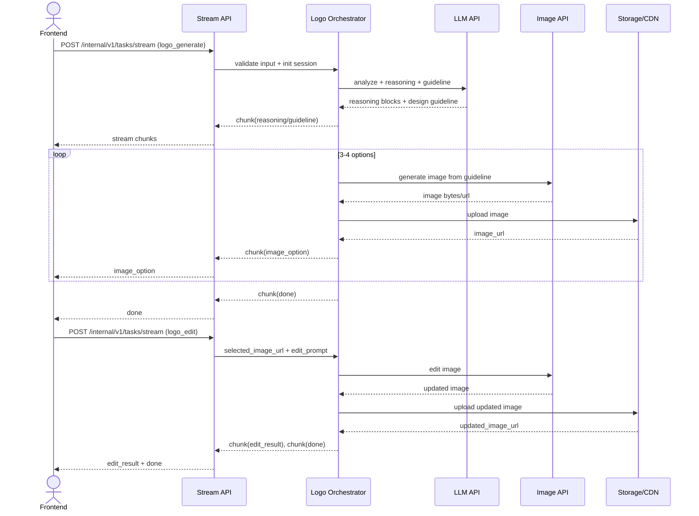

# Logo Design AI POC

## 1. Overview

### 1.1 POC objective

This POC builds a backend-driven Logo Design Service using a chat-first workflow:

- Input: user query (text, optional image references).
- Backend flow: analyze request, produce reasoning, produce design guideline, generate 3-4 logo options, apply prompt-based edits.
- Output: image URLs (minimum PNG 1024x1024) and edit summary.

Business validation goals:

- Prove users can complete the full loop: request -> analyze -> guideline -> generate -> select -> edit -> regenerate.
- Prove visible reasoning is understandable and useful.
- Prove editing is usable without region-level editing tools.

### 1.2 Success metrics

- >= 90% of requests return a design guideline before image generation starts.
- >= 90% of requests return 3-4 valid logo options.
- >= 85% of sessions complete end-to-end flow without restart.
- >= 85% of edit requests reflect requested changes while preserving core concept.
- p95 time to first reasoning chunk <= 1.5s.
- p95 time to complete 3-4 logo outputs <= 25s.
- On generation/edit failure, actionable error + retry guidance returned <= 3s.

### 1.3 Technical constraints

- Single image model in POC to reduce integration risk.
- No hardcoded business rule engine; use schema-driven and prompt-driven behavior.
- Out of scope: touch edit, smart mark, region/object-level editing.
- Session scope is single-session only.
- Stream API is primary channel for incremental UX.

---

## 2. POC Scope

### 2.1 Build vs Defer

| Area | Build (POC) | Defer |
| :--- | :--- | :--- |
| Intent + input | Detect logo intent, parse text/references, extract brand context | Multi-domain intent classifier |
| Clarification | Ask clarification when needed, allow skip with explicit assumptions | Adaptive multi-turn clarification policy |
| Reasoning | Stream reasoning blocks (input understanding, style inference, assumptions) | Multi-agent debate and self-critique loops |
| Guideline | Generate structured design guideline before generation | Auto-optimization guideline loop via evaluator |
| Generation | Generate 3-4 PNG options from guideline | Multi-model routing and auto-ranking |
| Editing | Prompt-based edit on selected option + edit summary | Region/object-level editing |
| Follow-up | Return quick follow-up suggestions | Personalized recommendation engine |
| Storage/session | Persist output URLs + metadata per request/session | Project library, version history, long-term memory |

---

## 3. System Architecture

### 3.1 Architecture principles (backend-first, reusable)

- Task-first:
  - Each business capability is an independent task (`logo_analyze`, `logo_generate`, `logo_edit`).
  - Routing is based on `task_type`, not endpoint-specific hardcoding.
- Schema-first:
  - All contracts are validated with Pydantic.
  - New inputs are added by extending schemas and task logic, without rewriting core flow.
- Stream-first:
  - `POST /internal/v1/tasks/stream` is the default execution path.
  - Frontend renders by chunk contract, independent of backend internals.
- Tool abstraction:
  - Agent uses local tools and MCP tools behind a stable interface.
  - Providers can be swapped without changing orchestration flow.

### 3.2 Runtime mapping to ai-hub-sdk

- Communication service:
  - Receives REST/gRPC requests and dispatches by `task_type`.
- Task execution layer:
  - `BaseTask`, `TaskInputBaseModel`, `TaskOutputBaseModel`.
  - `ServingMode.STREAM` for the core logo pipeline.
- Agent/orchestrator layer:
  - `Agent` + `Orchestrator` for planning, reasoning, and tool calling.
- Tool layer:
  - Function tools and MCP tools (HTTP/SSE, timeout, retry, tool filtering).
- Integration layer:
  - LLM API, optional vision API, image generation/edit API.
- Storage/observability:
  - Object storage/CDN for image assets.
  - Metadata and tracing for latency, usage, and cost.

### 3.3 End-to-end pipeline with clear ownership

Stage A - Analyze:

- Input: `LogoGenerateInput` (query, references, session_id).
- Handle:
  - intent detection
  - context extraction
  - clarification decision
  - assumptions generation if user skips clarification
- Stream outputs:
  - `clarification` (optional)
  - `reasoning`
  - `guideline`

Stage B - Generate:

- Input: guideline + generation parameters.
- Handle:
  - build model prompt from guideline
  - call image generation provider 3-4 times (or batch)
  - upload assets to storage
  - attach metadata (`seed`, `quality_flags`, timing)
- Stream outputs:
  - `image_option` x 3-4
  - `suggestion`
  - `done`

Stage C - Edit:

- Input: `LogoEditInput` (selected image, edit prompt, guideline).
- Handle:
  - parse edit intent
  - call image edit provider
  - upload edited result
  - produce edit summary
- Stream outputs:
  - `reasoning`
  - `edit_result`
  - `suggestion`
  - `done`


### 3.5 Orchestrator execution blueprint

```text
on_stream_request(task_type, input_args):
  validate_schema(task_type, input_args)
  init_request_context(request_id, session_id)

  if task_type == logo_generate:
    run logo_analyze
      -> emit clarification/reasoning/guideline
    run logo_generate
      -> emit image_option chunks
      -> emit suggestion + done

  if task_type == logo_edit:
    run logo_edit
      -> emit reasoning
      -> emit edit_result
      -> emit suggestion + done

  on_error:
    map_exception_to_error_code
    emit error chunk (retryable + suggested_action)
```

### 3.6 Reuse and extensibility (no hard rules)

- Add new style outputs:
  - extend guideline/schema fields, keep endpoint contract unchanged.
- Add or switch providers:
  - replace adapter in `ImageGenerationTool` or `ImageEditTool`.
- Add new capabilities:
  - register a new `task_type` (for example `logo_variation_regenerate`).
- Add external integrations:
  - attach new MCP tools with `tool_filter` for least privilege.

Rule placement strategy:

- Business behavior lives in schema + prompt templates + tool adapters.
- Communication layer stays generic and reusable.

### 3.7 Sequence diagram



---

## 4. Data Schema & API Integration

### 4.1 Pydantic models by stage

```python
from typing import Any, Dict, List, Literal, Optional
from pydantic import BaseModel, Field, HttpUrl


class ReferenceImage(BaseModel):
    source_url: Optional[HttpUrl] = None
    storage_key: Optional[str] = None


class BrandContext(BaseModel):
    brand_name: Optional[str] = None
    industry: Optional[str] = None
    style_preference: List[str] = Field(default_factory=list)
    color_preference: List[str] = Field(default_factory=list)
    symbol_preference: List[str] = Field(default_factory=list)


class Assumption(BaseModel):
    key: str
    value: str
    reason: str


class ClarificationQuestion(BaseModel):
    key: str
    question: str
    required: bool = False


class DesignGuideline(BaseModel):
    concept_statement: str
    style_direction: List[str]
    color_palette: List[str]
    typography_direction: List[str]
    icon_direction: List[str]
    constraints: List[str]
    assumptions: List[Assumption] = Field(default_factory=list)


class LogoGenerateInput(BaseModel):
    session_id: str
    query: str
    references: List[ReferenceImage] = Field(default_factory=list)
    allow_skip_clarification: bool = True
    variation_count: int = Field(default=4, ge=3, le=4)
    output_format: Literal["png"] = "png"
    output_size: Literal["1024x1024"] = "1024x1024"


class LogoOption(BaseModel):
    option_id: str
    image_url: HttpUrl
    prompt_used: Optional[str] = None
    seed: Optional[int] = None
    quality_flags: List[str] = Field(default_factory=list)


class LogoGenerateOutput(BaseModel):
    guideline: DesignGuideline
    options: List[LogoOption]


class LogoEditInput(BaseModel):
    session_id: str
    selected_option_id: str
    selected_image_url: HttpUrl
    edit_prompt: str
    guideline: DesignGuideline


class LogoEditOutput(BaseModel):
    updated_image_url: HttpUrl
    edit_summary: str
    preserved_elements: List[str] = Field(default_factory=list)


class StreamEnvelope(BaseModel):
    request_id: str
    session_id: str
    task_type: Literal["logo_analyze", "logo_generate", "logo_edit"]
    status: Literal["processing", "completed", "failed"]
    chunk_type: Literal[
        "reasoning", "clarification", "guideline", "image_option",
        "edit_result", "suggestion", "warning", "error", "done"
    ]
    sequence: int
    payload: Dict[str, Any] = Field(default_factory=dict)
    metadata: Dict[str, Any] = Field(default_factory=dict)
```

Validation rules:

- `query` is required and non-empty after trim.
- `variation_count` must be 3 or 4.
- Edit flow requires selected image and edit prompt.
- If clarification is skipped, guideline must include explicit assumptions.

### 4.2 Where external APIs are called

- LLM API:
  - `logo_analyze`: intent detection, input understanding, style inference.
  - `logo_generate`: guideline synthesis and reasoning stream.
- Vision API (optional):
  - analyze reference images for style/color/iconography extraction.
- Image API:
  - `logo_generate`: generate 3-4 logo options.
  - `logo_edit`: regenerate selected logo with edit prompt.

### 4.3 Concrete endpoint I/O

- `POST /internal/v1/tasks/stream` (`task_type=logo_generate`)
  - Input:
    - `query`
    - `session_id`
    - `references` (optional)
    - `variation_count` (optional, 3-4)
  - Output stream:
    - `clarification` (if needed)
    - `reasoning`
    - `guideline`
    - `image_option` x 3-4
    - `suggestion`
    - `done`

- `POST /internal/v1/tasks/stream` (`task_type=logo_edit`)
  - Input:
    - `session_id`
    - `selected_option_id`
    - `selected_image_url`
    - `edit_prompt`
    - `guideline`
  - Output stream:
    - `reasoning`
    - `edit_result`
    - `suggestion`
    - `done`

- Optional async fallback:
  - `POST /internal/v1/tasks/submit`
  - `GET /internal/v1/tasks/{task_id}/status`

---

## 5. Risks & Open Issues

### 5.1 Latency

Risk:

- Generating 3-4 images may exceed p95 target.

Mitigation:

- Emit reasoning early for visible progress.
- Parallel generation when provider supports it.
- Timeout and single retry for transient failures.
- Near-timeout fallback from 4 options to 3.

### 5.2 Generation quality

Risk:

- Outputs may drift from guideline or contain artifacts (noise, broken text, pixelation).

Mitigation:

- Apply `quality_flags` per option.
- Keep guideline-first prompt template consistent.
- Return warning + next edit suggestion when quality is below expectation.

### 5.3 Cost

Risk:

- Cost growth from combined LLM + image generation + iterative edits.

Mitigation:

- Track cost per `request_id` and `session_id`.
- Limit edit attempts in POC defaults.
- Reuse guideline/context inside session to reduce unnecessary calls.

### 5.4 Open technical decisions

- Primary frontend streaming protocol for production: NDJSON or gRPC stream.
- TTL and signed URL policy for image assets.
- Whether deterministic seed is required for edit consistency.
- Quality gate policy: hard fail vs soft warning.
