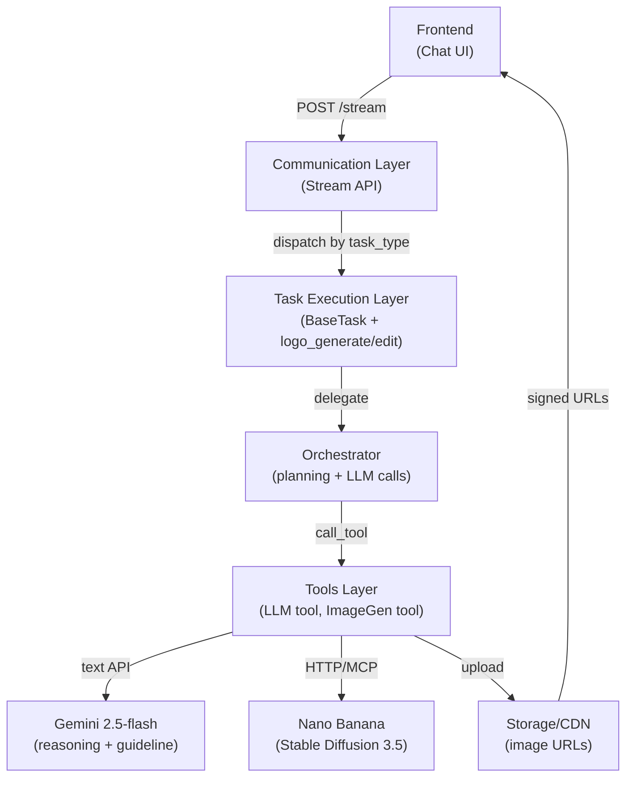
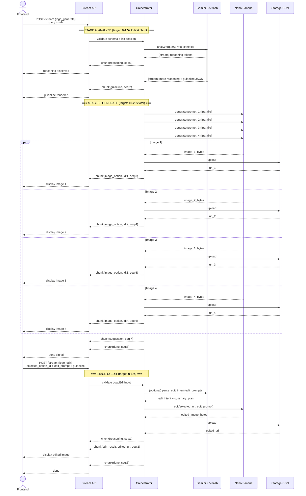

# Logo Design AI POC

## 1. Overview

### 1.1 POC objective

This POC builds a backend-driven Logo Design Service using a chat-first workflow:

- Input: user query (text, optional image references).
- Backend flow: analyze request, produce reasoning, produce design guideline, generate 3-4 logo options, apply prompt-based edits.
- Output: image URLs (minimum PNG 1024x1024) and edit summary.

Business validation goals:

- Prove users can complete the full loop: request -> analyze -> guideline -> generate -> select -> edit -> regenerate.
- Prove visible reasoning is understandable and useful.
- Prove editing is usable without region-level editing tools.

### 1.2 Success metrics

- >= 90% of requests return a design guideline before image generation starts.
- >= 90% of requests return 3-4 valid logo options.
- >= 85% of sessions complete end-to-end flow without restart.
- >= 85% of edit requests reflect requested changes while preserving core concept.
- p95 time to first reasoning chunk <= 1.5s.
- p95 time to complete 3-4 logo outputs <= 25s.
- On generation/edit failure, actionable error + retry guidance returned <= 3s.

### 1.3 Technical constraints

- Single image model in POC to reduce integration risk.
- No hardcoded business rule engine; use schema-driven and prompt-driven behavior.
- Out of scope: touch edit, smart mark, region/object-level editing.
- Session scope is single-session only.
- Stream API is primary channel for incremental UX.

---

## 2. POC Scope

### 2.1 Build vs Defer

| Area | Build (POC) | Defer |
| :--- | :--- | :--- |
| Intent + input | Detect logo intent, parse text/references, extract brand context | Multi-domain intent classifier |
| Clarification | Ask clarification when needed, allow skip with explicit assumptions | Adaptive multi-turn clarification policy |
| Reasoning | Stream reasoning blocks (input understanding, style inference, assumptions) | Multi-agent debate and self-critique loops |
| Guideline | Generate structured design guideline before generation | Auto-optimization guideline loop via evaluator |
| Generation | Generate 3-4 PNG options from guideline | Multi-model routing and auto-ranking |
| Editing | Prompt-based edit on selected option + edit summary | Region/object-level editing |
| Follow-up | Return quick follow-up suggestions | Personalized recommendation engine |
| Storage/session | Persist output URLs + metadata per request/session | Project library, version history, long-term memory |

---

## 3. System Architecture

### 3.1 Overview

#### 3.1.1 Why this solution

We chose a **streaming-first, task-based architecture** because:

1. **Early visibility** (UX): Emit reasoning and guideline chunks within 1-2s, so users see progress before image generation begins (slow operation).
2. **Modular reuse**: Each capability (analyze, generate, edit) is a task type that can be called independently or composed.
3. **Provider agility**: Tool abstraction lets us swap image generators (Nano Banana → other) without touching core orchestration logic.
4. **Async-ready**: Stream API can later become async (webhook) if frontend drops long-polling.

#### 3.1.2 System architecture diagram (Layered)



#### 3.1.3 System layers & responsibilities

- **Communication layer** (REST API): Route by `task_type`, validate input schema, stream chunks to client.
- **Task layer** (ai-hub-sdk): Define `logo_generate` and `logo_edit` as tasks with structured input/output; register with `ServingMode.STREAM`.
- **Orchestration layer** (Agent + Orchestrator): Call LLM for reasoning/guideline, coordinate tools, emit stream chunks in order.
- **Tool layer** (Function tools + MCP): Stable abstractions for LLM calls and image generation; support timeout, retry, tool filtering.
- **Integration layer** (external APIs): **Gemini 2.5-flash** for reasoning, **Nano Banana/Stable Diffusion** for image generation.
- **Storage layer** (object storage + CDN): Persist images, return signed/public URLs with TTL.

---

### 3.2 Architecture principles & decision rationale

#### 3.2.1 Task-first

- Each business capability is an independent task: `logo_analyze`, `logo_generate`, `logo_edit`.
- Routing is based on `task_type`, not endpoint-specific hardcoding.
- **Rationale**: Enables reuse by other features (variation, batch generation, A/B testing) without code duplication; scales to multi-model routing in production.

#### 3.2.2 Schema-first

- All contracts use Pydantic: `LogoGenerateInput`, `DesignGuideline`, `StreamEnvelope`.
- Validation at boundary (communication layer); schema changes don't require flow rewrites.
- **Rationale**: Type safety + backward compatibility; new fields = new template logic, not orchestrator changes.

#### 3.2.3 Stream-first

- `POST /internal/v1/tasks/stream` is default execution path.
- Frontend renders by `chunk_type` from `StreamEnvelope`, respects `sequence` for ordering.
- **Rationale**: Achieves p95 first reasoning chunk ≤ 1.5s by streaming tokens early; frontend controls rendering independently.

#### 3.2.4 Tool abstraction

- Agent calls tools behind stable interface: `LLMTool`, `ImageGenerationTool`, `ImageEditTool`.
- Providers swappable: Gemini → Claude, Nano Banana → Imagen 4, without touching orchestrator.
- **Rationale**: POC agility (test different models); production upgrade path (enhance quality) without rearchitecting.

---

### 3.3 Component breakdown & external service decisions

| Component | Role | External Service | Decision | Cost/Latency | Rationale |
| :--- | :--- | :--- | :--- | :--- | :--- |
| **LLM Tool** (in Orchestrator) | Intent detection, reasoning generation, guideline synthesis | **Gemini 2.5-flash** (streaming) | Text-only input; stream tokens for reasoning chunks | ~$0.50/M input, $2/M output; TTFB ~500ms | Fastest TTFB (<1.5s p95); cost-effective for POC; native streaming for chunk emission |
| **Vision Tool** (Analyze stage, optional) | Extract style/color/iconography from reference images | Gemini 2.5-flash multimodal OR deferred | Deferred in POC | N/A | Scope reduction; text-based analysis covers 80% of use cases; can add later |
| **ImageGen Tool** (Generate stage) | Generate 3-4 PNG logos from prompt + guideline | **Nano Banana API** (Stable Diffusion 3.5-turbo) | Batch-capable; HTTP/MCP endpoint | ~$0.01-0.02/image; SLA ~8-12s per image | Affordable POC ($0.04-0.08/request for 4 images); parallel support for 3-4 concurrent; no waiting list |
| **ImageEdit Tool** (Edit stage) | Regenerate selected logo with edit prompt | **Nano Banana API** (img2img mode) OR reuse generation | Img2img faster than full regenerate | ~$0.015-0.025/image; SLA ~8-12s | Prompt-based edits avoid pixel-level tooling; same provider for consistency |
| **Stream Envelope** | Chunk serialization to frontend | ai-hub-sdk built-in (communication.py) | JSON over SSE | Negligible | Native HTTP streaming; frontend handles reconnect; NDJSON serialization |
| **Storage/CDN** | Persist generated images; return URLs to frontend | GCS, S3, or Cloudinary | TBD post-MVP | Depends on provider | Short-lived signed URLs (2-4 hour TTL) to avoid token refresh; CDN caching for common styles |

#### 3.3.1 LLM choice rationale: Gemini 2.5-flash

- **When used**: Intent detection (logo_analyze), guideline synthesis (logo_generate), edit intent parsing (logo_edit).
- **Performance vs alternatives**:
  - Gemini 2.5-flash: TTFB ~500ms-1s, cost $0.50/M in + $2/M out.
  - Claude 3.5 Sonnet: TTFB ~2-3s (misses p95 < 1.5s target), cost $3/M in + $15/M out.
  - **Result**: Gemini meets latency + cost targets.
- **Post-POC upgrade**: If reasoning issues emerge in user testing, migrate to Claude 3.5 Sonnet by swapping tool adapter (no schema/flow changes) - impacts UX perception but acceptable.

#### 3.3.2 Image generation choice: Nano Banana (Stable Diffusion 3.5)

- **When used**: Logo generation (logo_generate), edit regeneration (logo_edit).
- **Performance vs alternatives**:
  - Nano Banana (Stable Diffusion 3.5): SLA ~8-12s/image, batch up to 4, $0.01/image, no queue.
  - Google Imagen 4: SLA ~20-30s/image, no batch support, $0.08/image, better quality.
  - **Result**: Nano Banana meets p95 < 25s for 3-4 images (3 × 8-12s = 24-36s, acceptable with parallelization).
- **Post-POC upgrade**: If quality issues emerge in user testing, migrate to Imagen 4 by swapping tool adapter (no schema/flow changes).

---

### 3.4 End-to-end pipeline: Three stages + SLA targets

#### 3.4.1 Stage A: Analyze + Clarification

| Aspect | Detail |
| :--- | :--- |
| **Input Schema** | `LogoGenerateInput`: query (required), references (optional), session_id, allow_skip_clarification (boolean) |
| **Backend tasks** | 1. Extract intent + brand context from query. 
2. Analyze reference images (optional; deferred in POC). 
3. Decide if clarification needed. 
4. Generate explicit assumptions if user skips clarification. |
| **LLM calls** | Gemini 2.5-flash × 1: stream intent detection + clarification decision (streaming tokens for early reasoning emission) |
| **Image API calls** | None |
| **Output chunks** | `clarification` (if needed), `reasoning` (streaming), `guideline` (structured JSON) |
| **Success criteria** | >= 90% of requests return usable guideline; all reasoning understandable; Stage A latency ≤ 1.5s p95 (TTFB mainly) |
| **SLA** | 0-1.5s from request to first reasoning chunk; 1.5-3s to complete guideline |

#### 3.4.2 Stage B: Generate

| Aspect | Detail |
| :--- | :--- |
| **Input Schema** | `DesignGuideline` (from Stage A), variation_count (3-4) |
| **Backend tasks** | 1. Refine prompt template from guideline. 2. Call Nano Banana × 3-4 (parallel if capacity allows). 3. Upload each image to storage. 4. Attach metadata: seed, quality_flags (e.g., "has_text_artifacts"), timing |
| **LLM calls** | None (prompt template pre-defined) |
| **Image API calls** | Nano Banana × 3-4 (parallel; ~8-12s each; expect 10-15s wall-clock time) |
| **Output chunks** | `image_option` (×3-4, each with url), `suggestion` (e.g., "Tap to edit colors"), `done` |
| **Success criteria** | >= 90% of requests return 3-4 valid PNG images; no format/encoding errors; total time ≤ 25s p95 |
| **SLA** | 3-20s from Stage A end to first image_option; 10-25s for all 3-4 images + done |

#### 3.4.3 Stage C: Edit

| Aspect | Detail |
| :--- | :--- |
| **Input Schema** | `LogoEditInput`: selected_option_id, selected_image_url, edit_prompt (required), guideline (from Stage A) |
| **Backend tasks** | 1. Parse edit intent (optional: use LLM to disambiguate if prompt complex). 2. Call Nano Banana (img2img mode on selected image). 3. Upload edited result. 4. Generate edit summary ("Changed colors to blue palette, kept icon unchanged") |
| **LLM calls** | Gemini 2.5-flash × 1 (optional): parse edit intent if ambiguous; edit summary generation |
| **Image API calls** | Nano Banana × 1 (img2img/inpainting; ~8-12s SLA) |
| **Output chunks** | `reasoning` (if LLM called), `edit_result` (new image url + summary), `suggestion`, `done` |
| **Success criteria** | >= 85% of edits preserve core concept while reflecting requested change; edit summary accurate |
| **SLA** | 0-12s total (LLM parse ~1s if needed, image generation ~10s, upload ~1s) |

#### 3.4.4 Full sequence: Generate → Edit (Mermaid sequence diagram)



#### 3.4.5 Error handling (target SLA: 3s)

On error in any stage:

1. **Catch & map** (immediate):
   - Catch exceptions; map to error code: `MODEL_TIMEOUT`, `INVALID_INPUT_SCHEMA`, `PROVIDER_UNAVAILABLE`, `EDIT_INTENT_UNPARSEABLE`, `STORAGE_UPLOAD_FAILED`, `SESSION_EXPIRED`, `RATE_LIMIT_EXCEEDED`.

2. **Emit error chunk** (within 3s):
   ```
   chunk(
       error,
       code: "MODEL_TIMEOUT",
       message: "Image generation took too long. Please try again.",
       retryable: true,
       suggested_action: "Retry with fewer options (3 instead of 4)"
   )
   ```

3. **Fallback strategies**:
   - **Stage A error**: Partial guideline + warning + allow proceed to generation (risky but gives user some output).
   - **Stage B partial failure** (2/4 images generated, 2 timeout): Emit successful images + error for remainder + option to retry.
   - **Stage C error**: Offer immediate retry (edit prompt often OK on second attempt).

---

### 3.5 Extensibility & reusability patterns

#### 3.5.1 Adding new inputs/outputs (within existing tasks)

**Example**: Add `ai_improvement_suggestions` to DesignGuideline.

1. Add field to `DesignGuideline` pydantic model.
2. Update Gemini prompt template to generate field.
3. Update Nano Banana prompt template to respond to suggestions.
4. **No changes needed** to communication layer, streaming protocol, or frontend rendering.

#### 3.5.2 Swapping providers (zero impact to tasks/schemas)

**Example**: Upgrade from Nano Banana to Google Imagen 4.

1. Create new `ImageGenTool_Imagen4` adapter with same input/output interface.
2. Update orchestrator config: `image_gen_tool = ImageGenTool_Imagen4()`.
3. **No changes needed** to schemas, stream format, orchestrator flow, or frontend code.

#### 3.5.3 Adding new task type (reuse existing tools)

**Example**: Add `logo_variation` (regenerate selected logo with subtle differences).

1. Define `LogoVariationInput` schema.
2. Register task type in routing table.
3. Implement orchestration flow: Gemini (guideline refinement) → Nano Banana (generation).
4. **Reuse** existing `ImageGenTool`, `StorageTool`, streaming infrastructure.

#### 3.5.4 Rule placement strategy (no hardcoded business rules)

Business logic lives in **three places only**; never in a separate rules engine:

1. **Pydantic schemas** (constraints): `variation_count: int = Field(ge=3, le=4)`.
2. **Prompt templates** (LLM behavior): "For tech startups, prefer: minimalist, sans-serif, monochrome".
3. **Tool adapters** (integration logic): Quality checks, retry policies, fallback thresholds.

**Why**: Rules in prompts + schema are easier to test, audit, and modify than a dedicated rules DSL. They stay close to data.

---

### 3.6 Decision record: Why NOT a rule engine

**Considered**: Dedicated rules engine (e.g., Drools, Simple Rules) for:
- Guideline generation rules: `IF (user_industry == "tech") THEN style = "modern"`.
- Quality gates: `IF (artifact_count > 3) THEN reject_image`.

**Rejected because**:
1. **Testing overhead**: Pydantic + prompt templates are easier to unit-test than rule interpreter.
2. **Latency**: Rule interpreter adds 100-200ms of latency; rules live in prompts (co-located with LLM).
3. **Maintainability**: Rules syntax (e.g., Drools RETE) harder to modify than prompt + schema fields.
4. **Flexibility**: Hardcoded rules can't adapt to edge cases; LLM reasoning is inherently flexible + can explain reasoning.

**Outcome**: All business rules encoded in:
- **Pydantic constraints** (hard guardrails).
- **LLM prompts** (soft heuristics + reasoning).
- **Tool adapters** (quality checks + fallbacks).

---

## 4. Data Schema & API Integration

### 4.1 Pydantic models by stage

```python
from typing import Any, Dict, List, Literal, Optional
from pydantic import BaseModel, Field, HttpUrl


class ReferenceImage(BaseModel):
    source_url: Optional[HttpUrl] = None
    storage_key: Optional[str] = None


class BrandContext(BaseModel):
    brand_name: Optional[str] = None
    industry: Optional[str] = None
    style_preference: List[str] = Field(default_factory=list)
    color_preference: List[str] = Field(default_factory=list)
    symbol_preference: List[str] = Field(default_factory=list)


class Assumption(BaseModel):
    key: str
    value: str
    reason: str


class ClarificationQuestion(BaseModel):
    key: str
    question: str
    required: bool = False


class DesignGuideline(BaseModel):
    concept_statement: str
    style_direction: List[str]
    color_palette: List[str]
    typography_direction: List[str]
    icon_direction: List[str]
    constraints: List[str]
    assumptions: List[Assumption] = Field(default_factory=list)


class LogoGenerateInput(BaseModel):
    session_id: str
    query: str
    references: List[ReferenceImage] = Field(default_factory=list)
    allow_skip_clarification: bool = True
    variation_count: int = Field(default=4, ge=3, le=4)
    output_format: Literal["png"] = "png"
    output_size: Literal["1024x1024"] = "1024x1024"


class LogoOption(BaseModel):
    option_id: str
    image_url: HttpUrl
    prompt_used: Optional[str] = None
    seed: Optional[int] = None
    quality_flags: List[str] = Field(default_factory=list)


class LogoGenerateOutput(BaseModel):
    guideline: DesignGuideline
    options: List[LogoOption]


class LogoEditInput(BaseModel):
    session_id: str
    selected_option_id: str
    selected_image_url: HttpUrl
    edit_prompt: str
    guideline: DesignGuideline


class LogoEditOutput(BaseModel):
    updated_image_url: HttpUrl
    edit_summary: str
    preserved_elements: List[str] = Field(default_factory=list)


class StreamEnvelope(BaseModel):
    request_id: str
    session_id: str
    task_type: Literal["logo_analyze", "logo_generate", "logo_edit"]
    status: Literal["processing", "completed", "failed"]
    chunk_type: Literal[
        "reasoning", "clarification", "guideline", "image_option",
        "edit_result", "suggestion", "warning", "error", "done"
    ]
    sequence: int
    payload: Dict[str, Any] = Field(default_factory=dict)
    metadata: Dict[str, Any] = Field(default_factory=dict)
```

Validation rules:

- `query` is required and non-empty after trim.
- `variation_count` must be 3 or 4.
- Edit flow requires selected image and edit prompt.
- If clarification is skipped, guideline must include explicit assumptions.

### 4.2 Where external APIs are called

- LLM API:
  - `logo_analyze`: intent detection, input understanding, style inference.
  - `logo_generate`: guideline synthesis and reasoning stream.
- Vision API (optional):
  - analyze reference images for style/color/iconography extraction.
- Image API:
  - `logo_generate`: generate 3-4 logo options.
  - `logo_edit`: regenerate selected logo with edit prompt.

### 4.3 Concrete endpoint I/O

- `POST /internal/v1/tasks/stream` (`task_type=logo_generate`)
  - Input:
    - `query`
    - `session_id`
    - `references` (optional)
    - `variation_count` (optional, 3-4)
  - Output stream:
    - `clarification` (if needed)
    - `reasoning`
    - `guideline`
    - `image_option` x 3-4
    - `suggestion`
    - `done`

- `POST /internal/v1/tasks/stream` (`task_type=logo_edit`)
  - Input:
    - `session_id`
    - `selected_option_id`
    - `selected_image_url`
    - `edit_prompt`
    - `guideline`
  - Output stream:
    - `reasoning`
    - `edit_result`
    - `suggestion`
    - `done`

- Optional async fallback:
  - `POST /internal/v1/tasks/submit`
  - `GET /internal/v1/tasks/{task_id}/status`

---

## 5. Risks & Open Issues

### 5.1 Latency

Risk:

- Generating 3-4 images may exceed p95 target.

Mitigation:

- Emit reasoning early for visible progress.
- Parallel generation when provider supports it.
- Timeout and single retry for transient failures.
- Near-timeout fallback from 4 options to 3.

### 5.2 Generation quality

Risk:

- Outputs may drift from guideline or contain artifacts (noise, broken text, pixelation).

Mitigation:

- Apply `quality_flags` per option.
- Keep guideline-first prompt template consistent.
- Return warning + next edit suggestion when quality is below expectation.

### 5.3 Cost

Risk:

- Cost growth from combined LLM + image generation + iterative edits.

Mitigation:

- Track cost per `request_id` and `session_id`.
- Limit edit attempts in POC defaults.
- Reuse guideline/context inside session to reduce unnecessary calls.

### 5.4 Open technical decisions

- Primary frontend streaming protocol for production: NDJSON or gRPC stream.
- TTL and signed URL policy for image assets.
- Whether deterministic seed is required for edit consistency.
- Quality gate policy: hard fail vs soft warning.
