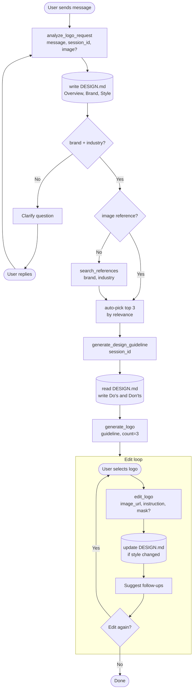
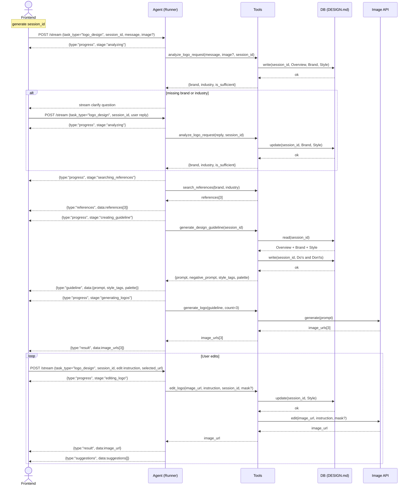
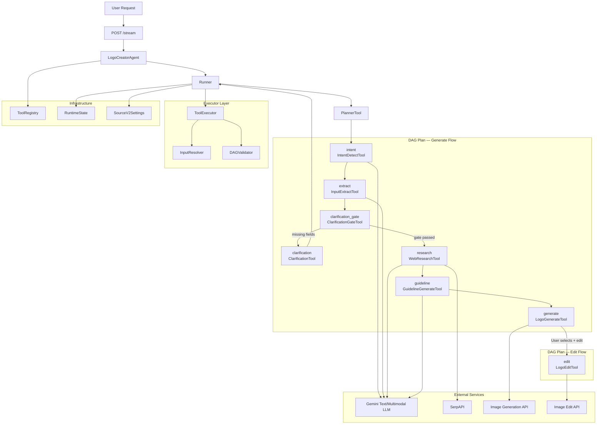

# Logo Design AI - Technical Design (source_v2)

## 1. Overview

### 1.1 Objective

Build a logo generation and editing backend using a **tool-first DAG orchestration runtime** (`source_v2`). The system plans, executes, and streams structured results through a reusable tool registry, an iterative DAG planner, and an executor with interpolation middleware.

In-scope:

- Intent detection and brand context extraction.
- Required-field gate and clarification loop with pause/re-plan.
- Web research enrichment for logo domain.
- Per-concept design guideline inference.
- Parallel logo option generation.
- **Image editing phase** — 3 editing cases (FE Mask + BE Inpainting, Minimal Edit, Crop-guided Edit).

Out-of-scope:

- Follow-up suggestion intelligence (Step 8).
- Multi-domain intent classifier.
- Production queue-decoupled deployment.

### 1.2 Success metrics

| Metric | Target |
|:---|:---|
| Requests that extract or clarify `brand_name` + `industry` before generation | >= 90% |
| Requests past required-field gate that produce valid guideline | >= 90% |
| Requests returning valid options payload | >= 85% |
| p95 stream end-to-end completion (generate flow) | <= 40s |
| Edit-flow single-image turnaround (Case 2) | <= 15s |
| On failure, return actionable `error_code` and `error_message` | 100% |

### 1.3 User journey (full flow including edit)

1. User submits query with optional explicit fields and references.
2. System streams DAG execution chunks (intent → extract → gate).
3. If required fields are missing, system emits `clarification_needed` and pauses.
4. User answers; system re-plans with post-clarification DAG (research → guideline → generate).
5. System returns completed payload with 3 logo options.
6. **User selects a logo and enters edit instruction** (with optional mask or crop).
7. System runs edit DAG → calls image edit API → updates DESIGN.md if style changed → returns edited image.
8. System suggests follow-up edits. User can loop back to step 6 or finish.

### 1.4 Technical constraints

- Runtime is `source_v2` package: tool-first DAG orchestration with `Runner` + `PlannerTool` + `ToolExecutor`.
- Tools are OOP classes (`V2BaseTool`) registered in `ToolRegistry`.
- DAG plans are Pydantic models (`DAGPlan`, `DAGNode`) validated by `DAGValidator` (cycle detection, dependency resolution).
- Tool inputs support `${...}` placeholder interpolation resolved by `InputResolver` at execution time.
- Clarification is handled via iterative DAG re-plan with `should_pause_for_clarification()` decision hook.
- Session state persisted in-memory via `RuntimeState` with `context_version` for stale-write-safe merges.
- Provider failures are fail-closed with explicit `ToolError` codes.

---

## 2. Scope

### 2.1 Build vs Defer

| Area | Build (source_v2) | Defer |
|:---|:---|:---|
| Intent + input | IntentDetectTool + InputExtractTool + ReferenceAnalyzeTool | Multi-domain intent classifier |
| Clarification | ClarificationGateTool + ClarificationTool + iterative re-plan | Adaptive personalized questioning policy |
| Research | WebResearchTool + ResearcherTool (SerpAPI + Gemini analyzer) | Automatic query backfill when image pool is insufficient |
| Guideline | GuidelineGenerateTool (parallel per-image inference) | Guideline optimization loop |
| Generation | LogoGenerateTool (parallel option generation) | Provider auto-routing/ranking |
| **Editing** | **LogoEditTool (Case 1/2/3)** | Multi-candidate ranking before edit output |
| Planning | PlannerTool (LLM-based DAG planning + deterministic fallback) | Multi-agent self-critique loops |
| Session/memory | RuntimeState + context_version versioning | Long-term project memory / version history |

### 2.2 Not yet implemented

- Production BFF stream controls (retry/reconnect/backpressure).
- Queue-decoupled deployment for heavy generation nodes.
- Confidence-threshold gate policy as hard rule.
- End-to-end cost analytics by task_id and session_id.
- Asset retention and signed URL TTL runtime policy.
- SAM model deployment for Case 1 (FE) and Case 3 (BE mask generation).

---

## 3. System Architecture

### 3.1 Overview

#### 3.1.1 Why this architecture

The source_v2 architecture is a **tool-first DAG runtime** with these key properties:

1. **Tool Registry** — reusable OOP tool classes with metadata-only context for planner prompts.
2. **DAG Planner** — LLM-based planning with deterministic fallback templates; supports iterative re-plan after clarification.
3. **Input Interpolation** — `${...}` bindings resolved at execution from `RuntimeState` (node results, query, user_context).
4. **Executor Middleware** — timeout, retry, and topological-order execution.
5. **Iterative Clarification** — pause/re-plan loop with `context_version` for stale-write-safe merges.
6. **Edit Loop** — iterative edit DAG with session state persistence for style tracking.

#### 3.1.2 Diagram — Full flow (flowchart)

> The following diagram shows the complete user journey including the edit loop:




#### 3.1.3 Diagram — Sequence diagram (full flow)

> The following diagram shows the detailed sequence including the edit loop:




#### 3.1.4 Diagram — DAG pipeline (source_v2 internals)



### 3.2 Architecture principles

- **Tool-first**: business logic is encapsulated in registerable tool classes with explicit input/output schemas.
- **Schema-first**: Pydantic models enforce DAG plan, tool IO, and runtime state contracts.
- **DAG-first planning**: LLM-based planner generates DAG JSON; deterministic templates as fallback.
- **Interpolation-driven**: `${...}` bindings decouple tool wiring from execution.
- **Iterative re-plan**: clarification pauses DAG, persists state, and resumes with post-clarification plan.
- **Fail-closed**: tool execution failures propagate explicit `ToolError` codes.
- **Context-versioned**: `RuntimeState.context_version` prevents stale-write conflicts.

#### 3.2.1 Memory flow contract (source_v2)

1. `Runner` owns the execution loop state — `RuntimeState` including `node_results`, `artifacts`, `context_version`.
2. `PlannerTool` receives `runtime_state` and `tool_contexts` to generate DAG plans.
3. `ToolExecutor` runs nodes in topological order, resolving `${...}` inputs from `RuntimeState`.
4. `RuntimeState` is persisted per `session_id` in `Runner._runtime_sessions` (in-memory).
5. Clarification follow-up restores state from persisted session or `user_context.runtime_state`.
6. `context_version` increments on each persist to detect version conflicts.

#### 3.2.2 Simplification notes

- Planner and executor are separate modules but run in one stream lifecycle.
- DAG execution is sequential (topological order), not parallelized across independent nodes.
- Session store is in-memory (`dict`) — does not survive process restarts.
- Edit flow reuses the same `Runner` and `ToolRegistry` infrastructure.

### 3.3 Component breakdown

#### 3.3.1 Agent layer

| Component | Role | Notes |
|:---|:---|:---|
| LogoCreatorAgent | High-level facade; wires registry, planner, executor, and runner | Entry point for external callers |
| Runner (BaseRunner) | Iterative DAG execution loop with clarification pause and re-plan | Owns `RuntimeState`, session persistence, chunk emission |

#### 3.3.2 Planner layer

| Component | Role | Notes |
|:---|:---|:---|
| PlannerTool (BasePlanner) | LLM-based DAG planner with deterministic fallback templates | Supports `async_genai` and `openai` frameworks; auto-repair on malformed output |
| planner_templates | `build_default_logo_plan()` and `build_post_clarification_plan()` | Deterministic fallback DAGs |
| DAGValidator | Topological sort + cycle detection + dependency validation | Throws `DAGValidationError` |

#### 3.3.3 Executor layer

| Component | Role | Notes |
|:---|:---|:---|
| ToolExecutor (BaseToolExecutor) | Execute DAG nodes with timeout and retry middleware | Skips clarification node when gate passes |
| InputResolver | Resolve `${...}` placeholders against `RuntimeState` | Supports nested paths like `${extract.result.context.brand_name}` |
| ExecutionValidator | Decision hook: `should_pause_for_clarification()` | Checks clarification_gate result |

#### 3.3.4 Tool layer — Generate flow

| Tool | DAG node id | Purpose | Delegates to |
|:---|:---|:---|:---|
| IntentDetectTool | `intent` | Detect logo generation intent | `LogoDesignToolset.detect_intent_async()` |
| InputExtractTool | `extract` | Extract brand context from query + references | `LogoDesignToolset.extract_inputs_async()` |
| ReferenceAnalyzeTool | — | Analyze reference images for visual preferences | `LogoDesignToolset.analyze_reference_images_async()` |
| ClarificationGateTool | `clarification_gate` | Check `brand_name` + `industry` presence | `RequiredFieldState.from_context()` |
| ClarificationTool | `clarification` | Generate clarification questions for missing fields | `LogoDesignToolset.suggest_clarifications_async()` |
| WebResearchTool | `research` | Collect web references and multimodal analyses | `WebResearchService.run_async()` |
| ResearcherTool | — | High-level wrapper for web research results | Wraps `WebResearchTool` |
| GuidelineGenerateTool | `guideline` | Generate per-concept design guidelines | `LogoDesignToolset.infer_guideline_for_image_async()` (parallel) |
| LogoGenerateTool | `generate` | Generate logo options from guidelines | `OptionGenerationService.iter_generate_async()` |
| ToolSearchTool | — | Search available tools by name/description | Local keyword search on `ToolContext` |

#### 3.3.5 Tool layer — Edit flow

| Tool | DAG node id | Purpose | Delegates to |
|:---|:---|:---|:---|
| LogoEditTool | `edit` | Edit a generated logo (Case 1/2/3) | Image Edit API (Gemini, gpt-image, Flux) |

#### 3.3.6 Schema layer

| Schema | Purpose |
|:---|:---|
| DAGPlan | Plan containing `planning_mode`, `nodes[]`, `edges[]` |
| DAGNode | Single node: `id`, `tool`, `tool_input`, `deps[]` |
| PlanningMode | Enum: `single_pass` or `iterative` |
| RuntimeState | Mutable execution state: `input`, `node_results`, `artifacts`, `clarification_round`, `context_version` |
| ToolContext | Metadata-only tool contract for planner prompts |
| ToolResult | Node execution result with `result`, `error`, `trace` |
| ToolError | Structured error with `code` and `message` |
| LargePayloadRef | Stable artifact reference for oversized payloads |
| ArtifactKind | Enum: `inline`, `file`, `object_store`, `vector_store` |

### 3.4 End-to-end pipeline

#### 3.4.1 Generate flow — Default DAG

```
intent → extract → clarification_gate → [clarification] → research → guideline → generate
```

Planner template: `build_default_logo_plan()`

| Node | Tool | Input bindings | Dependencies |
|:---|:---|:---|:---|
| `intent` | `intent_detect` | `query: ${query}` | — |
| `extract` | `input_extract` | `query: ${query}`, `references: ${user_context.references}` | `intent` |
| `clarification_gate` | `clarification_gate` | `context: ${extract.result.context}` | `extract` |
| `clarification` | `clarification_tool` | `missing_fields: ${clarification_gate.result.missing_fields}`, `query: ${query}`, `current_context: ${extract.result.context}` | `clarification_gate` |
| `research` | `web_research` | `brand_context: ${extract.result.context}` | `clarification_gate` |
| `guideline` | `guideline_generate` | `brand_context: ${extract.result.context}`, `research_context: ${research.result.research_context}` | `research` |
| `generate` | `logo_generate` | `task_id: ${task_id}`, `guidelines: ${guideline.result.guidelines}`, `brand_name: ${extract.result.context.brand_name}`, `industry: ${extract.result.context.industry}`, `variation_count: ${user_context.variation_count}` | `guideline` |

#### 3.4.2 Post-clarification DAG

When `clarification_answer` is provided and `extract` result exists:

```
research → guideline → generate
```

Planner template: `build_post_clarification_plan()`

The Runner applies `clarification_answer` fields (brand_name, industry, style_preference, color_preference, symbol_preference, typography_direction) into the existing `extract.result.context` before re-planning.

#### 3.4.3 Edit flow — Edit DAG

After generation completes, user can enter the edit loop:

```
edit (→ update_design_md → suggest_follow_ups)
```

Frontend sends: `POST /stream` with `task_type="logo_design"`, `session_id`, `edit_instruction`, `selected_url`, optional `mask` or `crop`.

| Item | Detail |
|:---|:---|
| Input | `image_url` (selected logo), `instruction` (edit prompt), optional `mask` or `crop_image` |
| Tool used | `LogoEditTool` → Image Edit API |
| Editing case | Auto-detected based on input presence (mask → Case 1, crop → Case 3, neither → Case 2) |
| DESIGN.md update | If style changed, update session's DESIGN.md |
| Output | Edited `image_url` + trace metadata + `suggestions[]` |
| Loop | User can continue editing or finish |

#### 3.4.4 Clarification loop mechanics

1. `ToolExecutor` executes `clarification_gate` node.
2. If `gate.result.passed == false`, executor continues to `clarification` node (generates questions).
3. `ExecutionValidator.should_pause_for_clarification()` returns `true`.
4. `Runner` emits `clarification_needed` chunk with `missing_fields`, `questions`, and full `runtime_state`.
5. `Runner` persists `RuntimeState` to session store with version check.
6. On next call, `Runner` restores state, applies `clarification_answer`, and `PlannerTool` returns `build_post_clarification_plan()`.
7. Max rounds configured via `max_clarification_rounds` (default: 2).

#### 3.4.5 Stream status progression

Generate flow:
```
planning_ready → intent_ready → context_extracted → clarification_gate_checked →
  [clarification_questions_ready → clarification_needed] →
  research_completed → guideline_completed →
  generation_option_ready (repeated) → generation_completed → completed
```

Edit flow:
```
planning_ready → editing_logo → edit_completed → completed
```

---

## 4. Image Editing Phase

### 4.1 Phase objective

- Enable controlled edits on generated logos.
- Prioritize region accuracy, output consistency, and response speed.
- Capture measurable metrics for latency, cost, quality, and user satisfaction.

### 4.2 Three editing cases

| Case | Purpose | Frontend Input | Backend Handling | Output | Key Risks |
|:---|:---|:---|:---|:---|:---|
| Case 1: FE Mask + BE Inpainting | Precise local edit with clear protected area | Source image + Binary mask (white=edit, black=keep) + Prompt | Inpainting model edits white region, preserves black region, blends edges | Edited image + trace metadata | Wrong mask quality, boundary artifacts |
| Case 2: Minimal Edit (No Mask) | Fast editing with lowest UI complexity | Source image + Prompt only | Edit/generation model receives image+prompt; no hard mask constraint | Edited image + trace metadata | Over-editing outside target area |
| Case 3: Crop-guided Edit | Keep FE simple while still using mask constraints | Source image + Bounding-box crop image + Prompt | BE runs SAM/segmenter on source+crop to create mask, then inpainting | Edited image + generated mask + trace metadata | Crop too loose/tight, mask derivation errors |

### 4.3 Case details

#### 4.3.1 Case 1 — FE Mask + BE Inpainting

**Step 1: Frontend (Data Initialization)**
1. User clicks a detail on the generated logo.
2. FE runs SAM in browser and creates `Mask_Image` (white = edit region, black = keep region).
3. FE setup: `npm install onnxruntime-web`, load SAM ONNX weights (lazy-load on first click), inference via WebAssembly/WebGPU.
4. User enters edit instruction (e.g., "Turn this shape into a fire dragon").
5. FE calls `POST /edit` with: `Original_Image`, `Mask_Image`, `Raw_Prompt`.

**Step 2: Backend (Inpainting Execution)**
1. BE calls an image edit/inpainting API with `image`, `mask`, `prompt`.
2. Model behavior: keep 100% of black-mask pixels, regenerate white-mask region, auto-blend boundaries.

#### 4.3.2 Case 2 — Minimal Edit (1 image + 1 prompt)

**Step 1: Frontend**
1. FE sends only `Original_Image` and `Raw_Prompt`.

**Step 2: Backend**
1. BE calls image edit/generation model with image+prompt.
2. Model understands prompt semantically; internal attention acts as implicit mask.
3. BE injects preservation instruction (keep layout/style where possible).
4. Return edited image and trace metadata.

#### 4.3.3 Case 3 — Source + Crop + Prompt (Mask generated in BE)

**Step 1: Frontend**
1. FE sends: `Original_Image`, `Crop_Image` (bounding-box crop of target region), `Raw_Prompt`.

**Step 2: Backend**
1. Locate crop region against original image.
2. Run SAM (or another segmenter) in backend to convert crop into binary mask.
3. Run inpainting with `Original_Image` + generated mask + `Raw_Prompt`.
4. Return edited image, optional debug mask, and trace metadata.

### 4.4 Edit tool integration in source_v2

```python
class LogoEditInput(ToolInput):
    image_url: str
    instruction: str
    session_id: str
    mask_image: str | None = None        # Case 1: base64 or URL
    crop_image: str | None = None        # Case 3: base64 or URL
    editing_case: str | None = None      # "case_1", "case_2", "case_3" or auto-detect

class LogoEditOutput(ToolOutput):
    edited_image_url: str
    editing_case: str
    mask_used: bool
    trace: dict
```

Auto-detection logic:
- `mask_image` present → Case 1
- `crop_image` present → Case 3
- Neither → Case 2

---

## 5. Image Models Benchmark

### 5.1 Generation models (logo generation — Stage C)

| Model | Used in | Notes |
|:---|:---|:---|
| Gemini Image Generation | `LogoGenerateTool` → `OptionGenerationService` | Current default for logo option generation |

### 5.2 Editing models

| Name | Pricing | Avg Cost | Avg Latency | Latency vs Output Token | Recommended Use Case | Case Fit | Note |
|:---|:---|:---|:---|:---|:---|:---|:---|
| google/gemini-2.5-flash-image (Nano Banana) | $30/1M output tokens; ~1,290 tokens/1024px (~$0.039/image) | $0.039 (1024px) | ~6s | Positive — latency grows with output token count | Low-cost bulk generation, rapid prototyping, high-throughput creation | Case 2 | Free tier exists with rate limits |
| google/gemini-3.1-flash-image-preview (Nano Banana 2) | ~$0.045–$0.151/image; 1024px ~$0.067 | $0.067 (1024px) | 23–56s (avg ~37.6s) | Weak/unclear correlation | High-quality premium generation, larger-resolution marketing assets | Case 2 | Preview-phase variability |
| google/gemini-3-pro-image-preview (Nano Banana Pro) | ~$0.02–$0.08/image | ~$0.05 | 3–12s | Increases with resolution | Professional-grade, stronger text rendering, high-res brand graphics | Case 2 | Supports up to 4K-class outputs |
| openai/gpt-image-1 | Low $0.011, Medium $0.042, High $0.167 | $0.042 (medium) | ~45–50s | Higher quality tiers increase latency | General-purpose generation/editing | Case 2 | Token-based billing in some modes |
| openai/gpt-image-1.5 | Low $0.009–$0.052, Medium $0.034–$0.051, High $0.133–$0.200 | $0.034 (medium) | 15–45s | Increases with quality tier | Premium marketing edits, stronger prompt adherence | Case 2 | Faster than gpt-image-1 |
| black-forest-labs/flux-fill-pro | Fixed ~$0.05/exec | $0.05 | ~9s | Minimal — fixed-size inpainting | Inpainting, local replacement, content-aware fill | **Case 1, Case 3** | Good for production edit pipelines |
| black-forest-labs/flux-kontext-pro | ~$0.04/image | $0.04 | ~7s | Low sensitivity | Fast iterative editing with strong content preservation | Case 2, Case 3 | Good trade-off for interactive tools |
| black-forest-labs/flux-kontext-max | ~$0.08/image (premium) | $0.08 | N/A | N/A | Highest-fidelity editing, final-asset polishing | Case 2, Case 3 | Premium tier for quality |
| black-forest-labs/flux-kontext-dev | ~$0.025/image | $0.025 | N/A | N/A | Development, experimentation, low-cost testing | Case 2 (R&D), Case 3 (R&D) | Often non-commercial license |
| prunaai/flux-kontext-fast | ~$0.005/image | $0.005 | Sub-second to few seconds | Scales with resolution/steps | Real-time creative apps, low-latency web experiences | Case 2 | Very cost-effective for prototyping |
| black-forest-labs/flux-2-flex | ~$0.06/image | $0.06 | ~13s | Scales with diffusion steps | Balanced quality/speed for production | Case 2, Case 3 | Tunable quality-speed trade-off |
| black-forest-labs/flux-2-dev | ~$0.025/image | $0.025 | N/A | N/A | Open-weight experimentation | Case 2 (R&D), Case 3 (R&D) | Self-host option possible |

### 5.3 Model selection strategy

| Editing Case | Primary Model | Fallback Model | Rationale |
|:---|:---|:---|:---|
| Case 1 (FE Mask) | flux-fill-pro | flux-kontext-pro | flux-fill-pro is purpose-built for mask-based inpainting |
| Case 2 (Minimal) | gemini-2.5-flash-image | gpt-image-1.5 | Best cost/latency ratio for prompt-only editing |
| Case 3 (Crop-guided) | flux-kontext-pro | flux-fill-pro | Strong content preservation with backend mask generation |

### 5.4 Benchmark template

#### Dataset

| ID | Image Model Benchmark Result |
|:---|:---|
| 1 |  |

**Testcase:**

**Testcase explanation**

**Input**

| Input |  |
|:---|:---|
| Model |  |
| Output |  |

**Result**

| Result |  |
|:---|:---|
|  |  |

| ID | Image Model Benchmark Result |
|:---|:---|
| 2 |  |

**Testcase:**

**Testcase explanation**

**Input**

| Text Input |  |
|:---|:---|
| Image Input |  |
| Model |  |
| Output |  |

**Result**

| Result |  |
|:---|:---|
|  |  |

#### Benchmark notes
- Use the same source image set across all models.
- Record prompt, resolution, latency, and user feedback for each run.
- For Case 1, validate black-region preservation and white-region edit fidelity.
- For Case 3, store crop alignment diagnostics and backend-generated mask path.
- For Case 2, track layout drift and over-edit frequency due to implicit masking behavior.
- When a model is listed as Case 2 only, avoid using it for strict masked inpainting.

---

## 6. Data Schema and API Integration

### 6.1 Pydantic models (source_v2 schemas)

```python
# --- DAG ---
class PlanningMode(str, Enum):
    single_pass = "single_pass"
    iterative = "iterative"

class DAGNode(BaseModel):
    id: str                           # Unique node identifier
    tool: str                         # Registered tool name
    tool_input: dict[str, Any] = {}   # ${...} interpolation bindings
    deps: list[str] = []              # Dependency node ids

class DAGPlan(BaseModel):
    planning_mode: PlanningMode = PlanningMode.iterative
    nodes: list[DAGNode] = []
    edges: list[tuple[str, str]] = []  # Auto-derived from deps

# --- Runtime ---
class RuntimeState(BaseModel):
    input: dict[str, Any] = {}
    node_results: dict[str, ToolResult] = {}
    artifacts: dict[str, LargePayloadRef] = {}
    clarification_round: int = 0
    context_version: int = 0

# --- Tool IO ---
class ToolResult(BaseModel):
    node_id: str
    tool_name: str
    result: Any = None
    error: ToolError | None = None
    trace: dict[str, Any] = {}
    produced_at: float

class ToolError(BaseModel):
    code: str
    message: str

class LargePayloadRef(BaseModel):
    ref_id: str
    kind: ArtifactKind     # inline, file, object_store, vector_store
    preview: str | None
    uri_or_key: str

# --- Tool Context (for planner prompts) ---
class ToolContext(BaseModel):
    name: str
    description: str
    parameters: dict[str, Any] = {}
    output: dict[str, Any] = {}
```

### 6.2 Tool input/output schemas

```python
# IntentDetectTool
class IntentDetectInput(ToolInput):
    query: str

class IntentDetectOutput(ToolOutput):
    is_logo_intent: bool
    confidence: float
    reason: str

# InputExtractTool
class InputExtractInput(ToolInput):
    query: str
    references: list[dict] = []

class InputExtractOutput(ToolOutput):
    context: dict     # BrandContext fields
    confidence: float
    reason: str

# ClarificationGateTool
class ClarificationGateInput(ToolInput):
    context: dict = {}

class ClarificationGateOutput(ToolOutput):
    passed: bool
    missing_fields: list[str] = []

# ClarificationTool
class ClarificationInput(ToolInput):
    missing_fields: list[str] = []
    query: str
    current_context: dict = {}

class ClarificationOutput(ToolOutput):
    questions: list[dict] = []

# WebResearchTool
class WebResearchInput(ToolInput):
    brand_context: dict = {}
    requested_optional_fields: list[str] = []

class WebResearchOutput(ToolOutput):
    research_context: dict

# GuidelineGenerateTool
class GuidelineGenerateInput(ToolInput):
    brand_context: dict = {}
    research_context: dict = {}

class GuidelineGenerateOutput(ToolOutput):
    guidelines: list[dict] = []

# LogoGenerateTool
class LogoGenerateInput(ToolInput):
    task_id: str
    guidelines: list[dict] = []
    brand_name: str | None = None
    industry: str | None = None
    variation_count: int = 1    # [1, 4]

class LogoGenerateOutput(ToolOutput):
    options: list[dict] = []

# LogoEditTool (new)
class LogoEditInput(ToolInput):
    image_url: str
    instruction: str
    session_id: str
    mask_image: str | None = None
    crop_image: str | None = None
    editing_case: str | None = None

class LogoEditOutput(ToolOutput):
    edited_image_url: str
    editing_case: str
    mask_used: bool
    trace: dict
```

### 6.3 Validation rules and merge precedence

- `query` must be non-empty after trim.
- Required-field gate requires both `brand_name` and `industry`.
- Clarification answer merge precedence: `answer fields > existing extract.result.context`.
- Supported clarification fields: `brand_name`, `industry`, `style_preference`, `color_preference`, `symbol_preference`, `typography_direction`.
- Empty string for optional scalar fields is normalized to `None`.
- `variation_count` defaults to 1 (configurable via `user_context`).
- Edit case auto-detection: mask → Case 1, crop → Case 3, neither → Case 2.

### 6.4 Endpoint mapping

```
POST /stream (task_type="logo_design")
  → Generate flow: intent → extract → gate → [clarification] → research → guideline → generate
  → Edit flow: edit (with selected_url + instruction + optional mask/crop)
```

Stream status progression — see Section 3.4.5.

### 6.5 Configuration

```python
class SourceV2Settings(BaseSettings):
    planner_framework: str = "async_genai"           # or "openai"
    planner_model: str = "gemini-2.5-flash"
    planner_api_key: str | None = None
    planner_temperature: float = 0.0
    planner_repair_attempts: int = 1
    planner_use_llm: bool = True

    google_api_key: str | None = None
    gemini_text_model: str = "gemini-2.5-flash"

    max_clarification_rounds: int = 2
    tool_timeout_seconds: float = 90.0
    retry_attempts: int = 1

    inline_payload_limit_chars: int = 4000
```

---

## 7. Risks and open issues

### 7.1 Latency

**Risk:** Web research + multimodal analysis can increase p95 latency for generate flow.

**Mitigation:**
- Bounded query policy and fetchable-image filtering.
- Parallel guideline inference (`asyncio.gather`).
- DAG topology allows future parallelization of independent nodes.

### 7.2 Provider reliability

**Risk:** Provider internal errors, media fetch restrictions, or edit API unavailability.

**Mitigation:**
- Executor retry middleware (configurable `retry_attempts`).
- Timeout middleware (configurable `tool_timeout_seconds`).
- Explicit `ToolError` propagation with stage-specific error codes.
- Model fallback strategy per editing case (see Section 5.3).

### 7.3 Clarification loop quality

**Risk:** Ambiguous inputs can trigger repeated clarification turns.

**Mitigation:**
- Max clarification rounds enforced (`max_clarification_rounds = 2`).
- Targeted clarification questions from LLM with deterministic fallback.
- Session state reuse across clarification turns.

### 7.4 Edit quality

**Risk:** Over-editing outside target area (Case 2), mask quality issues (Case 1), crop-to-mask conversion errors (Case 3).

**Mitigation:**
- Model selection strategy per case (see Section 5.3).
- Preservation instruction injection for Case 2.
- SAM-based mask validation for Case 3.
- Trace metadata capture for quality diagnostics.

### 7.5 Planner reliability

**Risk:** LLM-based planner may produce malformed or semantically invalid DAG plans.

**Mitigation:**
- DAGValidator structural validation (cycle detection, dependency resolution).
- Semantic guard validation (required nodes, input path verification).
- Auto-repair attempt on malformed output.
- Deterministic template fallback when all LLM attempts fail.
- Convention enforcement layer (`_enforce_logo_conventions`).

### 7.6 Open technical decisions

- SAM model deployment strategy for Case 1 (FE ONNX) and Case 3 (BE inference).
- Default editing model selection (Case 2) — gemini-2.5-flash vs gpt-image-1.5.
- Multi-candidate ranking before edit output.
- Acceptable cost/request threshold for editing.
- Session store persistence strategy (current `dict` → Redis/DB).
- Production BFF transport controls and stream resilience policy.
- Queue/service decoupling roadmap for heavy generation nodes.
- Cost tracking/reporting by task_id and session_id.
- Asset URL TTL and retention policies.
- Whether mask should be mandatory for small or dense typography edits.

---

## 8. Rollout recommendation

- **Phase 1:** Ship generate flow + Case 2 (image+prompt) editing to collect fast feedback.
- **Phase 2:** Add Case 1 mask-assisted inpainting for high-precision edits.
- **Phase 3:** Add Case 3 crop-to-mask conversion and model auto-routing.
- **Phase 4:** Optimize multi-candidate ranking, cost analytics, and production infrastructure.

---

## 9. References

### 9.1 Source code (source_v2)

| Module | Path |
|:---|:---|
| Package root | `source_v2/__init__.py` |
| Configuration | `source_v2/config.py` |
| README | `source_v2/README.md` |

**Agents:**

| File | Purpose |
|:---|:---|
| `source_v2/agents/base.py` | `BaseRunner` abstract contract |
| `source_v2/agents/runner.py` | `Runner` — iterative DAG execution with clarification pause |
| `source_v2/agents/logo_creator_agent.py` | `LogoCreatorAgent` — high-level facade |

**Planner:**

| File | Purpose |
|:---|:---|
| `source_v2/planner/base.py` | `BasePlanner` abstract contract |
| `source_v2/planner/planner_tool.py` | `PlannerTool` — LLM-based DAG planner |
| `source_v2/planner/planner_templates.py` | Deterministic DAG templates |
| `source_v2/planner/dag_models.py` | Re-export of DAGNode, DAGPlan, PlanningMode |
| `source_v2/planner/dag_validator.py` | `DAGValidator` — cycle/dependency validation |

**Executors:**

| File | Purpose |
|:---|:---|
| `source_v2/executors/base.py` | `BaseToolExecutor` abstract contract |
| `source_v2/executors/tool_executor.py` | `ToolExecutor` — timeout, retry, topological execution |
| `source_v2/executors/input_resolver.py` | `InputResolver` — `${...}` placeholder resolution |
| `source_v2/executors/validator.py` | `ExecutionValidator` — clarification pause decision |
| `source_v2/executors/result.py` | Re-export of ToolError, ToolResult |

**Schemas:**

| File | Purpose |
|:---|:---|
| `source_v2/schemas/plan.py` | DAGPlan, DAGNode, PlanningMode |
| `source_v2/schemas/runtime_state.py` | RuntimeState |
| `source_v2/schemas/tool_context.py` | ToolContext, build_tool_contexts |
| `source_v2/schemas/tool_io.py` | ToolResult, ToolError, LargePayloadRef, ArtifactKind |

**Tools:**

| File | Purpose |
|:---|:---|
| `source_v2/tools/base_tool.py` | `V2BaseTool` — base tool with output validation |
| `source_v2/tools/registry.py` | `ToolRegistry` — in-memory tool registration |
| `source_v2/tools/intent_detect_tool.py` | Intent detection |
| `source_v2/tools/input_extract_tool.py` | Brand context extraction |
| `source_v2/tools/reference_analyze_tool.py` | Reference image analysis |
| `source_v2/tools/clarification_gate_tool.py` | Required-field gate |
| `source_v2/tools/clarification_tool.py` | Clarification question generation |
| `source_v2/tools/web_research_tool.py` | Web research collection |
| `source_v2/tools/researcher_tool.py` | High-level research wrapper |
| `source_v2/tools/guideline_generate_tool.py` | Design guideline generation |
| `source_v2/tools/logo_generate_tool.py` | Logo option generation |
| `source_v2/tools/tool_search_tool.py` | Tool search by keyword |

### 9.2 Design references

- Image editing phase template: `image-editing-phase-template.en.md`
- Root SDK overview: `README.md`
