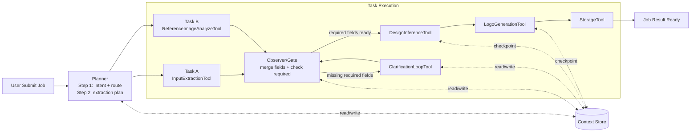
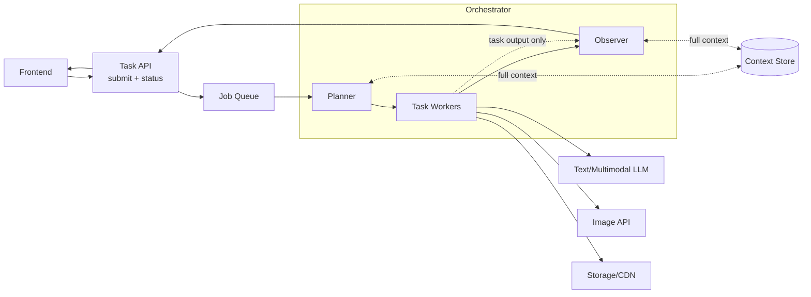
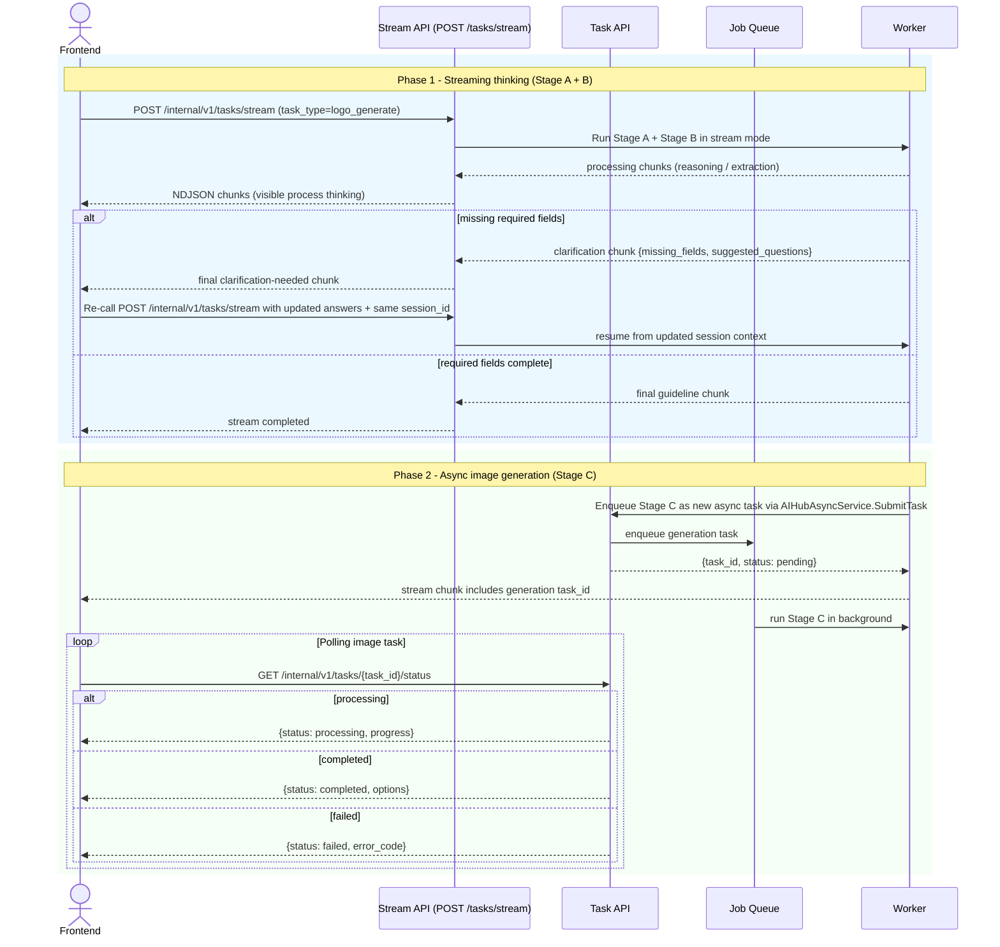
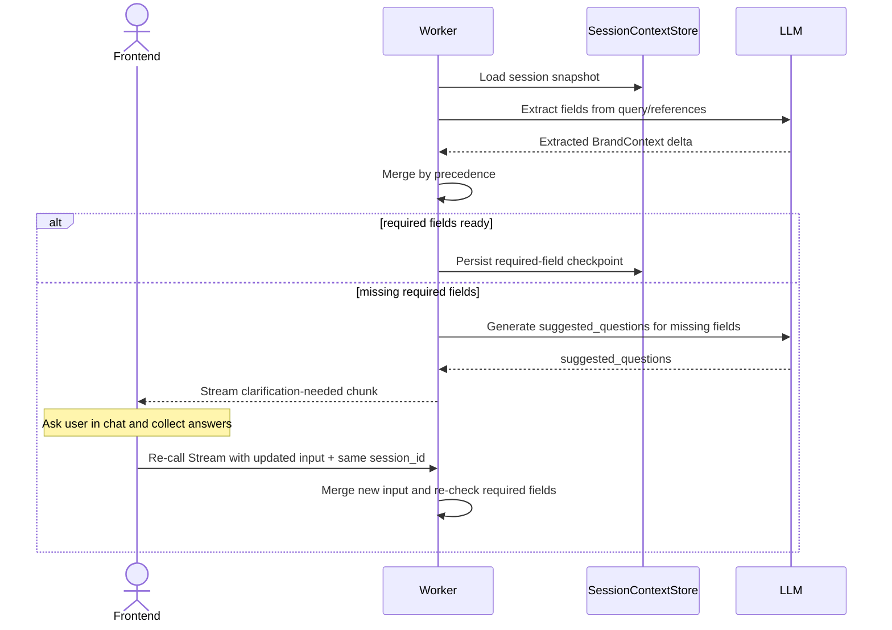
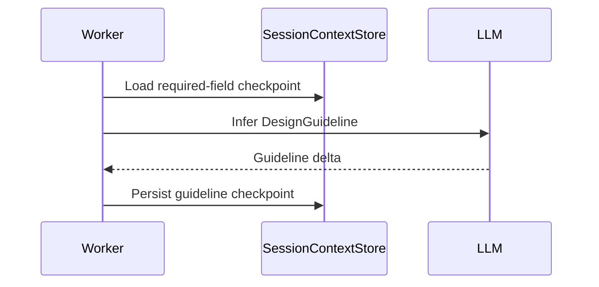
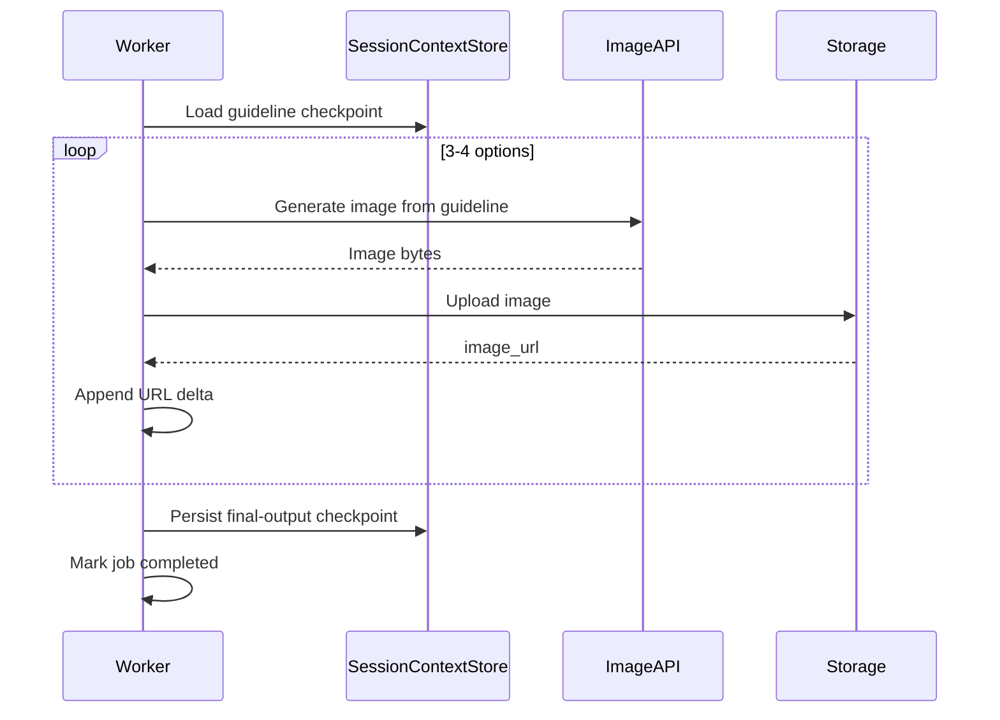

# Logo Design AI POC

## 1. Overview

### 1.1 POC objective

Build an async backend Logo Design Service for Step 1 -> Step 6 only.

In-scope:

- Step 1: intent detect
- Step 2: input extraction + reference analysis
- Step 3: required-field validation and clarification
- Step 4: design guideline inference
- Step 6: generate 3-4 logo options

Out-of-scope:

- Step 7: prompt-based editing
- Step 8: follow-up suggestions

### 1.2 Success metrics (POC acceptance targets)

- >= 90% requests extract brand_name and industry from user query.
- >= 90% requests that pass required-field gate produce valid `guideline` before image generation starts.
- >= 85% requests return 3-4 valid logo options.
- p95 job completion time <= 30s (from submit to completed).
- p95 time to first status transition (pending -> processing) <= 5s.
- On failure, return actionable error + retry hint <= 5s.

### 1.3 User Journey (5-step POC flow)

1. **User enters logo request** → Submit query with optional brand details
2. **System shows thinking** → Frontend shows "Processing..." with streaming reasoning visible
3. **If missing info** → System asks clarification question (e.g., "What is your brand name?"), user answers in chat
4. **System generates guideline** → Design guideline created, user sees it via stream
5. **System generates logo options** → 3-4 logo options generated and displayed
6. **User sees results** → Complete logos with brand context

Key UX point: User sees real-time reasoning via Stream and may re-call Stream with updated input when clarification is needed.

### 1.4 Technical constraints

- AI Hub SDK APIs are fixed by framework and must be used as-is:
  - `AIHubAsyncService.SubmitTask`
  - `AIHubAsyncService.GetTaskStatus`
  - `AIHubStreamService.Stream`
- HTTP gateway mapping follows SDK default routes:
  - `POST /internal/v1/tasks/submit`
  - `GET /internal/v1/tasks/{task_id}/status`
  - `POST /internal/v1/tasks/stream`
- Frontend should communicate through a Backend-for-Frontend (BFF), which manages NDJSON/gRPC stream connections and forwards UI-friendly events.
- Primary task type for this POC: `logo_generate`.
- Required fields (mandatory before generation):
  - `brand_name` (company/product name)
  - `industry` (business category or context)
- Single request per job; input may be partial when `use_session_context` is enabled.
- Required-field precedence is fixed: explicit fields in request > extracted fields from new query > stored session context.
- Session scope is per `session_id` with short-term memory reuse across jobs.
- Provider switching must not change task semantics or output contract.

---

## 2. POC Scope

### 2.1 Build vs Defer

| Area | Build (POC) | Defer |
| :--- | :--- | :--- |
| Intent + input | Detect logo intent, parse text/references, extract brand context | Multi-domain intent classifier |
| Clarification | Fail-fast required-field validation with suggested follow-up questions | Adaptive personalized questioning policy |
| Reasoning | Internal reasoning for extraction and inference | Multi-agent self-critique loops |
| Guideline | Generate structured design guideline before generation | Automatic guideline optimization loop |
| Generation | Generate 3-4 PNG options from guideline | Auto model-routing and ranking |
| Storage/session | Persist output URLs + session context per `session_id` | Project library, version history, long-term memory |
| Editing | Deferred | Step 7 in next phase |
| Follow-up suggestion | Deferred | Step 8 in next phase |

---

## 3. System Architecture

### 3.1 Overview

#### 3.1.1 Why this solution

This architecture is designed for strict quality gating in POC with AI Hub native execution: Stream for real-time reasoning and clarification, then async SubmitTask/GetTaskStatus for long-running image generation.

This system behaves like a chat-based design assistant: users interact via streaming responses, and the system dynamically asks for missing information before completing the task.

Key reasons:

1. Fail-fast required-field validation enforces required design inputs before generation begins.
2. Hybrid execution improves UX: Stage A+B stream reasoning in real time, Stage C runs async for image generation.
3. All processing happens server-side; FE does not hold the connection.
4. Session context is explicit and propagated between tools for deterministic behavior.
5. In POC, planner is simplified to rule-based routing inside a single worker process.
6. Stream ends when guideline is ready; image generation always runs asynchronously.

#### 3.1.2 Diagram 1 - Agent pipeline (flowchart)



#### 3.1.3 Diagram 2 - System components (layered)



**Note for POC:** Planner, Observer, and Task Workers are logically separated but implemented as a single worker service to keep implementation simple. They can be decoupled into separate microservices in production.

### 3.2 Architecture principles

- Task-first:
  - Business capability exposed as `logo_generate` in this phase.
  - Routing by `task_type`, no endpoint-specific business hardcoding.
- Schema-first:
  - All contracts validated by Pydantic.
  - Required-field gate is encoded as schema and validator rules.
- Async job-based:
  - Hybrid execution is used with AI Hub service modes:
    - Stage A+B: `AIHubStreamService.Stream` for visible process thinking and clarification.
    - Stage C: `AIHubAsyncService.SubmitTask` + `AIHubAsyncService.GetTaskStatus` for background image generation.
  - In HTTP gateway form, Stage A+B uses `POST /internal/v1/tasks/stream` (NDJSON stream), not SSE.
  - Stage C uses `POST /internal/v1/tasks/submit` and `GET /internal/v1/tasks/{task_id}/status`.
- Context-first tool handoff:
  - Every step reads/writes the same session memory snapshot.
  - Tools return deltas only; worker merges and persists checkpoints.
  - Tool swap must preserve context I/O contract.

#### 3.2.1 Memory flow contract (context engineering style)

This section defines memory behavior so the pipeline is deterministic and easy to reason about:

1. **Worker keeps execution state**:
  - Worker owns `task_id`, `current_step`, round counters, and status transitions.
  - Task-local runtime state is not stored in tool adapters.
2. **Tools are stateless and receive lightweight context**:
  - Input to each tool is scoped to required fields only (`session_id`, required field state, relevant context slice).
  - Tools do not own global session memory.
3. **Tools return deltas, worker merges**:
  - Each tool returns only changed fields (delta), not full state overwrite.
  - Worker merges delta into current state using fixed precedence rules.
4. **Persist checkpoints in SessionContextStore**:
  - Save checkpoint after Stage A (required fields), Stage B (guideline), Stage C (final output URLs).
  - Cross-job reuse always loads from SessionContextStore.
5. **Use `context_version` for stale-write protection**:
  - Every write validates expected `context_version`.
  - On version mismatch, worker reloads latest context and retries merge.

#### 3.2.2 POC simplification notes

This design is prepared for production scale but POC implementation can be simplified:

- **Planner**: In POC, simplified to rule-based routing (no multi-model decision tree); planner logic is embedded in worker startup.
- **Queue**: In POC, queue is used only for Stage C image generation; Stage A+B runs synchronously within the stream handler.
- **Observer**: In POC, observer check is simple gate logic (required fields present?); no multi-path decision tree.

These can be formalized and decoupled in subsequent phases as system scales.

### 3.3 Component breakdown (tool-level)

| Component or Tool | Spec step | Role | Model Type | Notes |
| :--- | :--- | :--- | :--- | :--- |
| IntentDetectTool | Step 1 | Detect logo design intent and route flow | Low-latency text LLM | Deterministic classifier; if logo intent is detected, switch from generic image generation flow to Logo Design flow |
| InputExtractionTool | Step 2 | Extract brand_name, industry, style, color, symbol from text | Text LLM with structured output | Returns structured JSON (style/color optional) |
| ReferenceImageAnalyzeTool | Step 2 | Analyze reference image style/color/typography/iconography | Multimodal LLM | Optional when references provided |
| ClarificationLoopTool | Step 3 | Generate targeted clarification questions for missing required fields | Text LLM for question generation | If required fields are missing: worker emits clarification chunk in Stream response; client collects user answer and re-calls Stream with updated input/session context |
| DesignInferenceTool | Step 4 | Infer final guideline from completed context | Text LLM for design reasoning | Returns guideline JSON |
| LogoGenerationTool | Step 6 | Generate 3-4 logo options | Fast image generation model | Throughput-optimized |
| StorageTool | Shared | Upload images and return URLs | Cloud storage API | Used by generation |
| SessionContextTool | Shared | Read/update context snapshot per session and key job checkpoints | Context adapter over cache or DB | Required for deterministic tool swap |

### 3.4 End-to-end pipeline

POC exposes one external task type: `logo_generate`.

#### 3.4.1 Full sequence overview (Streaming + Async)

High-level flow:



#### 3.4.1a Stage A - Intake & clarification loop (Step 1-3)



#### 3.4.1b Stage B - Guideline inference (Step 4)



#### 3.4.1c Stage C - Logo generation (Step 6)


#### 3.4.2 Stage A - Intake and clarification loop (Step 1-3)

| Item | Detail |
| :--- | :--- |
| Input | `LogoGenerateInput` (query, optional explicit brand fields, references, session_id) |
| Tools used | IntentDetectTool, InputExtractionTool, ReferenceImageAnalyzeTool, ClarificationLoopTool |
| Output | Either (a) merged fields with brand_name + industry guaranteed, or (b) clarification-needed stream chunk so FE can re-call Stream with updated input |
| Gate | brand_name AND industry must both be present before Step 4; if missing, ask clarification via Stream chunk and continue on next Stream call |
| Target | Complete within first 10s of job start |

#### 3.4.3 Stage B - Request analysis and guideline inference (Step 4)

| Item | Detail |
| :--- | :--- |
| Input | Completed required fields + optional context |
| Tools used | DesignInferenceTool |
| Output | DesignGuideline JSON |
| Target | Guideline coverage >= 90% |

#### 3.4.4 Stage C - Logo generation (Step 6)

| Item | Detail |
| :--- | :--- |
| Input | guideline + variation_count |
| Tools used | LogoGenerationTool, StorageTool |
| Output | LogoGenerateOutput with 3-4 option URLs |
| Target | 3-4 valid outputs >= 85%, generation <= 30s total per job |
| Concurrency | SHOULD run in parallel when provider supports batching/multi-call concurrency |

### 3.5 Reuse and extensibility

- Add fields in extraction or guideline:
  - Extend schema and prompt templates only.
  - API contract stays unchanged.
- Add edit phase in next release:
  - Register `logo_edit` task type and add Stage D for Step 7.
  - Reuse same context and job semantics.
- Add provider:
  - Replace generation adapter only.
  - No change in worker state machine.

---

## 4. Data Schema and API Integration

### 4.1 Pydantic models by stage

```python
from typing import Any, Dict, List, Literal, Optional
from pydantic import BaseModel, Field, HttpUrl


class ReferenceImage(BaseModel):
    source_url: Optional[HttpUrl] = None
    storage_key: Optional[str] = None


class BrandContext(BaseModel):
    brand_name: Optional[str] = None
    industry: Optional[str] = None
    style_preference: List[str] = Field(default_factory=list)
    color_preference: List[str] = Field(default_factory=list)
    symbol_preference: List[str] = Field(default_factory=list)


class SuggestedQuestion(BaseModel):
    key: Literal["brand_name", "industry"]
    question: str


class RequiredFieldState(BaseModel):
    # Only 2 required fields for POC
    required_keys: List[str] = Field(default_factory=lambda: [
        "brand_name",      # Company or product name (MANDATORY)
        "industry",        # Business category or context (MANDATORY)
    ])
    missing_keys: List[str] = Field(default_factory=list)
    passed: bool = False


class DesignGuideline(BaseModel):
    concept_statement: str
    style_direction: List[str]
    color_palette: List[str]
    typography_direction: List[str]
    icon_direction: List[str]
    constraints: List[str]


class SessionContextState(BaseModel):
    session_id: str
    latest_brand_context: Optional[BrandContext] = None
    latest_guideline: Optional[DesignGuideline] = None
    required_field_state: RequiredFieldState = Field(default_factory=RequiredFieldState)
    generated_option_ids: List[str] = Field(default_factory=list)


class LogoGenerateInput(BaseModel):
    session_id: str
    query: str
    brand_name: Optional[str] = None
    industry: Optional[str] = None
    style_preference: List[str] = Field(default_factory=list)
    color_preference: List[str] = Field(default_factory=list)
    symbol_preference: List[str] = Field(default_factory=list)
    references: List[ReferenceImage] = Field(default_factory=list)
    use_session_context: bool = True
    variation_count: int = Field(default=4, ge=3, le=4)
    output_format: Literal["png"] = "png"
    output_size: Literal["1024x1024"] = "1024x1024"


class LogoOption(BaseModel):
    option_id: str
    image_url: HttpUrl
    prompt_used: Optional[str] = None
    seed: Optional[int] = None
    quality_flags: List[str] = Field(default_factory=list)


class LogoGenerateOutput(BaseModel):
    guideline: DesignGuideline
    required_field_state: RequiredFieldState
    options: List[LogoOption]


class JobSubmitResponse(BaseModel):
    task_id: str
    status: Literal["pending"]
    task_type: str


class JobStatusResponse(BaseModel):
    task_id: str
    status: Literal["pending", "processing", "completed", "failed"]
    task_type: str
    progress_percent: Optional[int] = None  # 0-100 if processing
    result: Optional[LogoGenerateOutput] = None  # populated when completed
    metadata: Optional[Dict[str, Any]] = None
    error_code: Optional[str] = None  # populated when failed (e.g., MISSING_REQUIRED_FIELDS)
    error_message: Optional[str] = None  # populated when failed
    missing_fields: List[str] = Field(default_factory=list)  # populated when failed
    suggested_questions: List[SuggestedQuestion] = Field(default_factory=list)  # populated when failed
    retry_after_seconds: Optional[int] = None  # populated when failed
```

Validation rules:

- `query` is required and non-empty after trim.
- `variation_count` must be 3 or 4.
- Required-field gate: brand_name AND industry must both be present before guideline generation.
- If extraction confidence is **below threshold** (e.g., < 70%), system SHOULD trigger clarification question instead of guessing; this avoids silent failures and improves UX transparency.
- Merge precedence is fixed: explicit fields in request > extracted fields from new query > stored context for same `session_id`.
  - **Example:**
    - User provides `brand_name` explicitly in request → use it
    - Else, extract `brand_name` from query via LLM
    - Else, reuse `brand_name` from previous session
- Empty-value precedence policy:
  - explicit empty string (e.g., `brand_name=""`) is treated as missing and does not override non-empty extracted/session value.
  - explicit `null` is treated as "not provided" and falls through to lower-precedence sources.
  - explicit empty optional lists (e.g., `style_preference=[]`) are valid explicit overrides.
- If `use_session_context=true`, backend may use stored context as the last precedence layer.
- If required fields are still missing after merge, return failed job with `error_code`, `missing_fields`, and `suggested_questions`.
- On `status="failed"` with `error_code="MISSING_REQUIRED_FIELDS"`, `missing_fields` and `suggested_questions` must be populated.

### 4.3 Concrete endpoint I/O (AI Hub SDK native)

This section follows AI Hub SDK fixed APIs. The design maps into existing async and stream services, and does not introduce custom REST endpoints.

- Stream reasoning and clarification (Stage A + B)
  - gRPC: `AIHubStreamService.Stream(TaskRequest) -> stream TaskStatus`
  - HTTP gateway: `POST /internal/v1/tasks/stream`
  - Media type: `application/x-ndjson` (JSON Lines), not SSE.
  - FE integration recommendation: browser UI talks to BFF; BFF owns stream connection and pushes normalized events to UI.
  - Request body pattern:
    ```json
    {
      "task_type": "logo_generate",
      "input_args": {
        "session_id": "sess-123",
        "query": "Design a logo for Nova",
        "brand_name": null,
        "industry": null,
        "use_session_context": true,
        "variation_count": 4
      },
      "priority": "high"
    }
    ```
  - Streaming chunks are used to render:
    - "Thinking..." messages
    - Step-by-step reasoning (input understanding, style inference, field validation)
    - Clarification question prompts
  - Clarification handling in AI Hub pattern:
    - Worker emits a `processing` chunk with `metadata.event_type = clarification_needed`, `missing_fields`, and `suggested_questions`.
    - FE asks user and collects answer.
    - FE re-calls `Stream` with updated `input_args` and same `session_id`.
    - On re-call, only updated fields are required in `input_args`; worker merges new input with session context by precedence (explicit > extracted > session).
    - Worker continues pipeline from merged context.

- Async generation and polling (Stage C)
  - gRPC submit: `AIHubAsyncService.SubmitTask(TaskRequest) -> SubmitTaskResponse`
  - HTTP gateway submit: `POST /internal/v1/tasks/submit`
  - Submit response example:
    ```json
    {
      "task_id": "uuid",
      "status": "pending",
      "task_type": "logo_generate"
    }
    ```
  - gRPC poll: `AIHubAsyncService.GetTaskStatus(GetTaskStatusRequest) -> TaskStatus`
  - HTTP gateway poll: `GET /internal/v1/tasks/{task_id}/status`
  - Stream/async boundary: Stream ends when guideline is ready; image generation always proceeds in async mode.
  - Processing response example:
    ```json
    {
      "task_id": "uuid",
      "status": "processing",
      "task_type": "logo_generate",
      "metadata": {
        "progress_percent": 45
      }
    }
    ```
  - Progress mapping (for UI progress bar only, not exposed as detailed user-facing steps):
    - 0-20: extraction
    - 20-40: guideline inference
    - 40-100: image generation (increment per image completion)
  - Completed response example:
    ```json
    {
      "task_id": "uuid",
      "status": "completed",
      "task_type": "logo_generate",
      "result": {
        "guideline": { /* DesignGuideline */ },
        "required_field_state": { /* RequiredFieldState */ },
        "options": [ /* List[LogoOption] */ ]
      }
    }
    ```
  - Failed response example:
    ```json
    {
      "task_id": "uuid",
      "status": "failed",
      "task_type": "logo_generate",
      "error_code": "MISSING_REQUIRED_FIELDS",
      "error_message": "Missing required fields after merge precedence",
      "metadata": {
        "missing_fields": ["brand_name", "industry"],
        "suggested_questions": [
          {
            "key": "brand_name",
            "question": "What is your company or product name?"
          },
          {
            "key": "industry",
            "question": "What industry is your business in?"
          }
        ],
        "retry_after_seconds": 60
      }
    }
    ```

- Context behavior
  - Merge precedence is fixed: explicit request fields > extracted query fields > stored context in same `session_id`.
  - Clarification is handled via Stream re-call with updated input, not via a dedicated clarification endpoint.
  - Final `result` must include `required_field_state` for explainability.

### 4.4 Model benchmark and tracing result

#### 4.4.1 Text models (planning baseline)

| Provider | Model | Input ($/1M) | Output ($/1M) | Typical latency | Role |
| :--- | :--- | :--- | :--- | :--- | :--- |
| google | gemini-2.5-flash | 0.30 | 2.50 | 2-6s | Primary extraction, clarification, inference |
| google | gemini-2.5-pro | 1.25 | 10.00 | 4-12s | Higher-depth reasoning fallback |
| openai | gpt-5.4-nano | 0.20 | 1.25 | 1.5-5s | Cost-sensitive fallback |
| openai | gpt-5.4-mini | 0.75 | 4.50 | 2-7s | Structured-output fallback |
| openai | gpt-5.4 | 2.50 | 15.00 | 4-14s | Quality-first fallback |

#### 4.4.2 Image models (tracing result)

Source trace: `logs/model_traces_benchmark_image_v4_tech_startup.json`

| Provider | Model | Status | Latency (ms) | Images requested | Images returned | Notes |
| :--- | :--- | :--- | :--- | :--- | :--- | :--- |
| google | gemini-2.5-flash-image | success | 20488 | 3 | 3 | Balanced baseline |
| google | gemini-3.1-flash-image-preview | success | 47039 | 3 | 3 | Slower preview model |
| google | gemini-3-pro-image-preview | success | 122664 | 3 | 3 | Slowest in this run |
| google | imagen-4.0-fast-generate-001 | success | 3961 | 3 | 3 | Fastest in this run |
| google | imagen-4.0-generate-001 | success | 19674 | 3 | 3 | Quality-oriented alternative |
| openai | gpt-image-1.5 | success | 30120 | 3 | 3 | Cross-vendor fallback |

#### 4.4.3 Best choice (POC)

- Text primary: `gemini-2.5-flash`
- Image primary: `imagen-4.0-fast-generate-001`
- Text fallback: `gpt-5.4-mini`
- Image fallback: `gpt-image-1.5`

Why this choice:

1. `imagen-4.0-fast-generate-001` is clearly fastest in current tracing run.
2. `gemini-2.5-flash` gives strong speed/cost balance for extraction and clarification.
3. OpenAI fallback keeps multi-provider resilience for production incidents.

---

## 5. Risks and open issues

### 5.1 Latency

Risk:

- Job completion may exceed p95 target depending on provider queue and image generation latency.

Mitigation:

- Parallel image generation where provider permits.
- Timeout + retry for transient provider failures.
- Queue scaling policy when backlog grows.
- Circuit breaker for provider outages.

### 5.2 Required-field validation quality

Risk:

- User intent may not include brand_name or industry explicitly; fail-fast may increase first-attempt failure rate.

Mitigation:

- Extract brand_name and industry early (Step 2) with high-confidence NLP.
- Return structured failure payload (`error_code`, `missing_fields`, `suggested_questions`) for FE-guided resubmission.
- Prioritize targeted suggested questions (e.g., "What is your company name?" before "What industry?").
- Allow inference from context (e.g., "design a logo for a fintech startup" → industry=fintech).

### 5.3 Cost

Risk:

- Failed attempts (missing required fields) and 3-4 image outputs increase cost per successful request.

Mitigation:

- Track cost per `task_id` and `session_id`.
- Cache extracted context in session and avoid redundant re-analysis.
- Keep benchmark table refreshed each milestone.

### 5.4 Open technical decisions

- Stream transport policy: gRPC stream timeout, HTTP NDJSON idle timeout, reconnect strategy, and chunk flush interval.
- Signed URL TTL policy by asset type.
- Job result retention: how long to keep completed job results available.
- Session context TTL and reset policy (auto expiry only vs manual reset endpoint).
- Default guideline style when `style_preference` is not provided (infer from industry vs hardcoded default).
- Fallback generation model if primary `gemini-3.1-flash-image-preview` fails mid-job.
