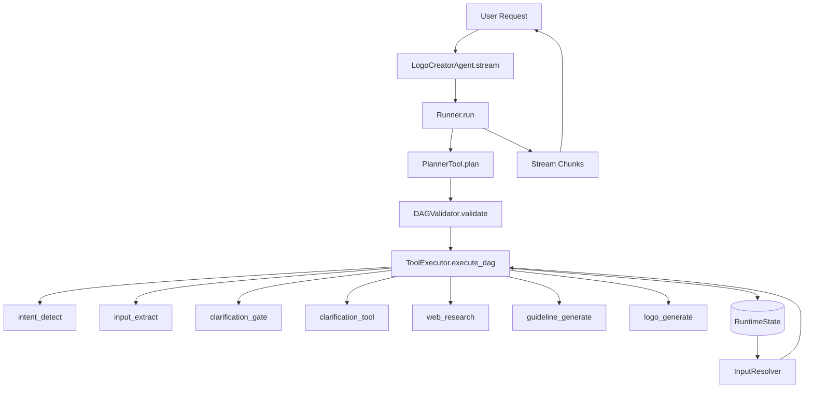
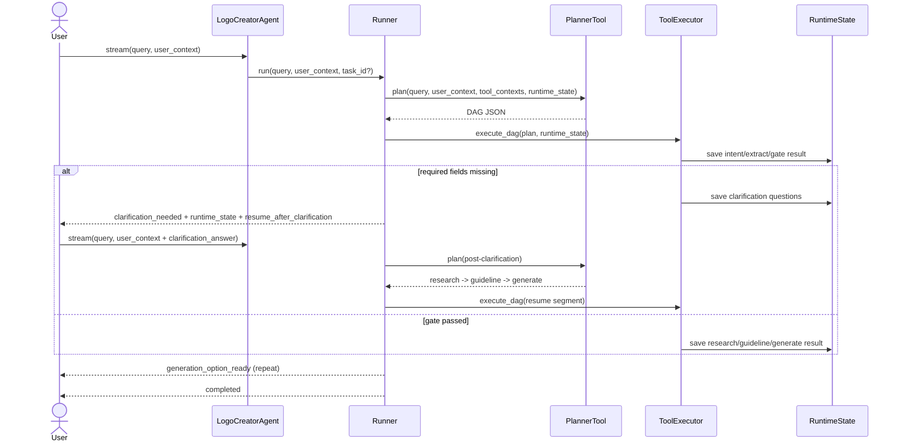
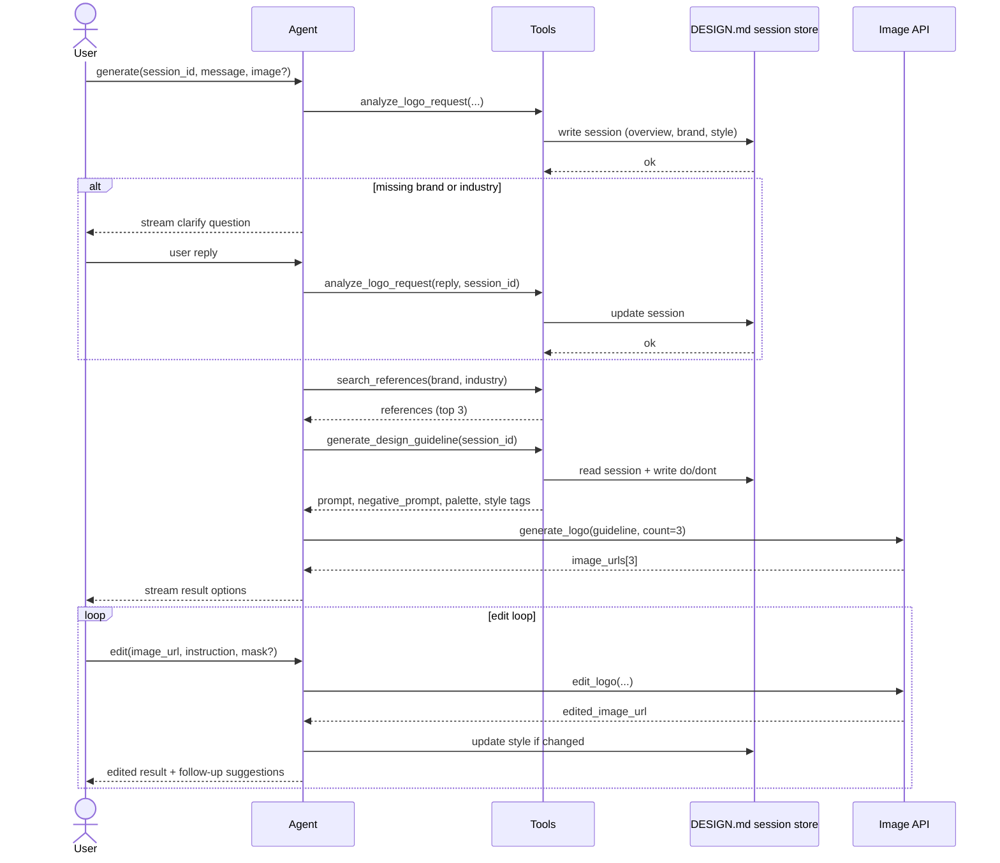

# Logo Design AI Technical Design (source_v2 + Edit Full Flow)

## 0. Metadata
- Project: Logo Design AI
- Owner: Logo-design team
- Date: 2026-04-11
- Version: 2.0 (source_v2 aligned)
- Status: In Review
- Scope: End-to-end logo generation and image editing workflow

---

## 1. Overview

### 1.1 Objective

Refactor technical design to match `source_v2` tool-first DAG runtime and extend the full flow with image editing loop.

Current implementation baseline:
- Generation flow is implemented in `source_v2` (intent -> extract -> clarification -> research -> guideline -> generate).
- Clarification pause/resume with session state is implemented.
- Stream-first execution is implemented.

Design extension in this document:
- Add Step 7 image editing flow (mask/no-mask/crop-guided) and follow-up loop.
- Define benchmark plan for text planning models and image generation/edit models.

### 1.2 Scope

In-scope:
- Step 1: Intent detection.
- Step 2: Input extraction and reference handling.
- Step 2.5: Web research enrichment.
- Step 3: Clarification gate and iterative clarification loop.
- Step 4: Guideline generation.
- Step 6: Logo generation.
- Step 7: Image editing loop design (integrated full flow design).

Out-of-scope for current codebase runtime:
- Step 8 production-grade follow-up intelligence ranking.
- Long-term persistent session store and cross-process recovery.

### 1.3 Success Targets

- >= 90% requests collect required fields (`brand_name`, `industry`) before generation.
- >= 90% gate-passed requests produce valid guideline payload.
- >= 85% requests return valid option payload.
- p95 end-to-end generation <= 40s in current runtime target.
- Edit flow p95 target:
  - Case 2 (no-mask edit): <= 25s.
  - Case 1 or 3 (mask-based): <= 30s.
- All failures return actionable `error_code` and `error_message`.

---

## 2. source_v2 Architecture

### 2.1 Design Principles

- Tool-first orchestration: each capability is a typed tool with explicit input/output schema.
- DAG-driven planning: planner emits executable node graph, executor resolves dependencies.
- Runtime-safe interpolation: `${...}` binding is resolved at execution time from runtime state.
- Iterative planning: clarification can pause execution and re-plan a post-clarification DAG segment.
- Fail-closed behavior: invalid DAG, unresolved bindings, and tool failures stop execution with explicit error.
- Payload budget safety: large final result can be returned as `options_ref` artifact instead of full inline body.

### 2.2 Runtime Modules

| Module | Responsibility |
| :--- | :--- |
| `source_v2/agents/logo_creator_agent.py` | High-level facade, tool registry wiring, runner bootstrap |
| `source_v2/agents/runner.py` | Stream orchestration, planning loop, pause/resume, session versioning |
| `source_v2/planner/planner_tool.py` | LLM plan generation, semantic guardrails, fallback template DAG |
| `source_v2/planner/dag_validator.py` | DAG validation (duplicate IDs, unknown deps, cycle detection) |
| `source_v2/executors/tool_executor.py` | Topological execution, timeout/retry, tool result persistence |
| `source_v2/executors/input_resolver.py` | `${...}` interpolation against `RuntimeState` |
| `source_v2/tools/*` | Typed business tools (intent, extract, clarification, research, guideline, generation) |
| `source_v2/schemas/*` | Plan, runtime state, tool context, tool result, artifact ref contracts |

### 2.3 Core Tool Set (Generation)

- `intent_detect`
- `input_extract`
- `clarification_gate`
- `clarification_tool`
- `web_research`
- `guideline_generate`
- `logo_generate`

Supporting tools:
- `reference_analyze`
- `researcher`
- `tool_search`

### 2.4 Baseline Planner DAG (Default)

```text
intent -> extract -> clarification_gate -> clarification
clarification_gate -> research -> guideline -> generate
```

Resume DAG after clarification answer:

```text
research -> guideline -> generate
```

---

## 3. Generation Flow (As-Built in source_v2)

### 3.1 Architecture Diagram



### 3.2 Sequence Diagram (Clarification + Resume)



### 3.3 Stream Milestones

Primary emitted `metadata.stage` values:
- `planning_ready`
- `intent_ready`
- `context_extracted`
- `clarification_gate_checked`
- `clarification_questions_ready`
- `clarification_needed`
- `research_completed`
- `guideline_completed`
- `generation_option_ready`
- `generation_completed`
- `completed`

Failure outputs include `error_code` and `error_message`.

---

## 4. Full Flow with Image Editing Loop

This section integrates generation + editing based on the provided flow and sequence diagrams.

### 4.1 End-to-End Full Flow Diagram

```mermaid
flowchart TD
  U1([User sends message]) --> A1[analyze_logo_request(message, session_id, image?)]
  A1 --> D1[(write DESIGN.md<br/>Overview, Brand, Style)]
  D1 --> G1{brand + industry?}

  G1 -- No --> Q1[Clarify question]
  Q1 --> U2([User replies])
  U2 --> A1

  G1 -- Yes --> G2{image reference?}
  G2 -- No --> R1[search_references(brand, industry)]
  R1 --> R2[auto-pick top 3 by relevance]
  R2 --> GG[generate_design_guideline(session_id)]
  G2 -- Yes --> GG

  GG --> D2[(read DESIGN.md<br/>write Do's and Don'ts)]
  D2 --> LG[generate_logo(guideline, count=3)]

  subgraph EDIT[Edit loop]
    U3([User selects logo]) --> E1[edit_logo(image_url, instruction, mask?)]
    E1 --> D3[(update DESIGN.md if style changed)]
    D3 --> S1[Suggest follow-ups]
    S1 --> G3{Edit again?}
    G3 -- Yes --> U3
  end

  LG --> U3
  G3 -- No --> DONE([Done])
```

### 4.2 Full Flow Sequence Diagram



### 4.3 Editing Cases

| Case | Frontend Input | Backend Handling | Best Fit |
| :--- | :--- | :--- | :--- |
| Case 1: FE mask + BE inpainting | Original image + binary mask + prompt | Strict inpainting on masked region | Precise local edits, typography-safe updates |
| Case 2: Minimal edit (no mask) | Original image + prompt | Semantic image edit without explicit mask | Fast UX iteration and low UI complexity |
| Case 3: Crop-guided edit | Original image + crop + prompt | BE generates mask via SAM, then inpainting | Balance between simple FE and precise region control |

---

## 5. Schemas and API Contracts

### 5.1 Generation Contracts (source_v2)

- Planner contract: `DAGPlan(planning_mode, nodes, edges)`.
- Runtime contract: `RuntimeState(input, node_results, artifacts, clarification_round, context_version)`.
- Tool result contract: `ToolResult(node_id, tool_name, result, error, trace)`.
- Large payload contract: `LargePayloadRef(ref_id, kind, preview, uri_or_key)`.

Execution-time binding:
- `InputResolver` resolves `${query}`, `${user_context.*}`, `${node_id.result.*}`.
- Defaults for missing user context:
  - `references = []`
  - `variation_count = 1`

Logo generation tool constraints:
- `variation_count` range: 1..4

### 5.2 Proposed Edit API Contracts

```python
class LogoEditInput(BaseModel):
    session_id: str
    image_url: str
    instruction: str
    case_mode: Literal["mask", "no_mask", "crop"]
    mask_image: str | None = None
    crop_image: str | None = None
    preserve_layout: bool = True

class LogoEditOutput(BaseModel):
    edited_image_url: str
    model_name: str
    case_mode: str
    style_updated: bool
    follow_ups: list[str] = []
    trace: dict[str, Any] = {}
```

Validation rules:
- `instruction` must be non-empty.
- `case_mode=mask` requires `mask_image`.
- `case_mode=crop` requires `crop_image`.
- `case_mode=no_mask` accepts only image + prompt.

---

## 6. Models Benchmark

### 6.1 Text and Planning Models (Step 1-4)

| Model | Role | Quality | Latency | Cost | Recommendation |
| :--- | :--- | :--- | :--- | :--- | :--- |
| `gemini-2.5-flash` | Planner, intent, extract, clarification, guideline prompting | High for structured output with guardrails | Low-Medium | Low-Medium | Default in `.env` for source_v2 |
| `gpt-4o-mini` | Alternative planner/extractor | Medium-High | Low-Medium | Medium | Optional fallback provider |
| `gpt-4o` | Complex reasoning and repair-heavy planning | High | Medium | High | Use when strict quality > cost |

### 6.2 Image Generation Models (Step 6)

| Name | Average Cost | Average Latency | Best Use Case | Notes |
| :--- | :--- | :--- | :--- | :--- |
| `gemini-2.5-flash-image` | ~$0.039/image (1024px) | ~6s | Default fast generation | Current env default image model |
| `gemini-3.1-flash-image-preview` | ~$0.067/image (1024px) | 23-56s | Higher quality campaign assets | Preview-tier latency variance |
| `gemini-3-pro-image-preview` | ~$0.05/image | 3-12s | Premium brand output | Higher quality tier |
| `openai/gpt-image-1.5` | ~$0.034/image (medium) | 15-45s | Strong prompt fidelity | Good alt provider |

### 6.3 Image Editing Models (Step 7)

| Name | Case Fit | Avg Cost | Avg Latency | Best Use Case |
| :--- | :--- | :--- | :--- | :--- |
| `black-forest-labs/flux-fill-pro` | Case 1, Case 3 | ~$0.05 | ~9s | Strict inpainting by mask |
| `black-forest-labs/flux-kontext-pro` | Case 2, Case 3 | ~$0.04 | ~7s | Fast interactive editing |
| `black-forest-labs/flux-kontext-max` | Case 2, Case 3 | ~$0.08 | N/A | Highest-fidelity polishing |
| `prunaai/flux-kontext-fast` | Case 2 | ~$0.005 | sub-second to few seconds | Real-time UX prototype |
| `openai/gpt-image-1.5` | Case 2 | tiered | 15-45s | Strong no-mask prompt edits |
| `gemini-2.5-flash-image` | Case 2 | ~$0.039 | ~6s | Cost-efficient no-mask edits |

### 6.4 Benchmark Protocol

- Use one fixed dataset across all models.
- Track per run: prompt, resolution, latency, cost, success/failure, user score.
- For Case 1 and Case 3, include region preservation score and edge artifact score.
- For Case 2, include drift score (non-target region changes).
- Report p50/p95 latency and cost per accepted output.

---

## 7. Risks and Mitigations

### 7.1 Generation Risks

- Invalid but syntactically valid planner DAG.
  - Mitigation: semantic guardrails + deterministic template fallback.
- Clarification loop never converges.
  - Mitigation: `max_clarification_rounds` cutoff and fail-fast error.
- Large payload memory pressure.
  - Mitigation: artifact reference (`options_ref`) fallback.

### 7.2 Edit Risks

- Incorrect mask boundary leads to artifacts.
  - Mitigation: mask QA checks + feathering.
- No-mask edit drifts entire logo.
  - Mitigation: enforce preservation instruction and optional auto-switch to Case 1 or 3.
- Crop-guided mask mismatch.
  - Mitigation: crop alignment diagnostics + debug-mask return.

---

## 8. Rollout Plan

1. Phase 1 (done): source_v2 generation flow with clarification and streaming.
2. Phase 2: integrate `logo_edit` endpoint with Case 2 (no-mask) baseline.
3. Phase 3: add Case 1 and Case 3 mask workflows.
4. Phase 4: style-memory update (`DESIGN.md`) and follow-up suggestion loop.
5. Phase 5: benchmarking automation and model auto-routing policy.

---

## 9. References

- `source_v2/README.md`
- `source_v2/agents/logo_creator_agent.py`
- `source_v2/agents/runner.py`
- `source_v2/planner/planner_tool.py`
- `source_v2/planner/planner_templates.py`
- `source_v2/planner/dag_validator.py`
- `source_v2/executors/tool_executor.py`
- `source_v2/executors/input_resolver.py`
- `source_v2/schemas/plan.py`
- `source_v2/schemas/runtime_state.py`
- `source_v2/schemas/tool_io.py`
- `source_v2/tools/logo_generate_tool.py`
- `source_v2/tools/web_research_tool.py`
- `image-editing-phase-template.en.md`
